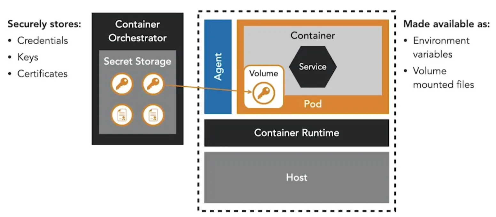
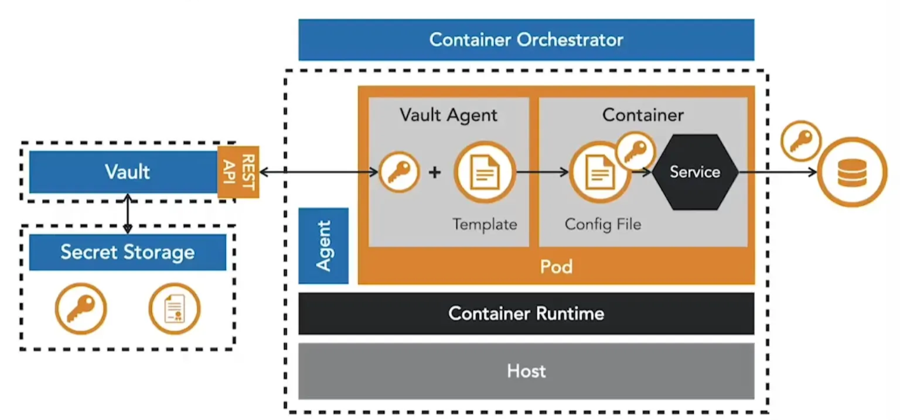
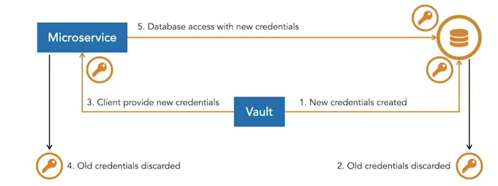

Microservices kræver ofte secrets som legitimationsoplysninger, databaseadgangskoder og SSL-certifikater. Hvis de opbevares usikkert (hardcodet i kildekode, indbygget i images eller eksponeret i miljøvariabler), skaber det alvorlige risici, da angribere kan udtrække dem fra repositories, registries eller hosts.

Container-orchestrators som Kubernetes og OpenShift leverer indbygget secrets management, hvilket eliminerer behovet for at indlejre secrets i images. Secrets kan injiceres i pods som miljøvariabler eller monteres som filer i volumes, hvor fil-mounts er den mere sikre løsning. Disse tilgange er dog begrænset til orchestratorens cluster.

**Vault fra HashiCorp** er en dedikeret secrets management-platform, der går ud over et enkelt cluster. Microservices kan hente secrets gennem Vaults API eller bruge en Vault Agent sidecar, der integrerer med orchestrators, håndterer autentificering og injicerer secrets i konfigurationsfiler uden ekstra applikationskode.

Vault understøtter også dynamiske secrets, som roteres automatisk, hvilket reducerer risikoen for langlivede legitimationsoplysninger. Med leases udstedes kortlivede legitimationsoplysninger hver gang adgang anmodes om, hvilket yderligere begrænser eksponeringen, hvis et secret kompromitteres.

<small> Kilde: [LinkedIn Learning: Securing Microservices](https://www.linkedin.com/learning/microservices-security/securing-microservices?contextUrn=urn%3Ali%3AlyndaLearningPath%3A645bcd56498e6459e79b3c71&resume=false&u=57075649)</small>