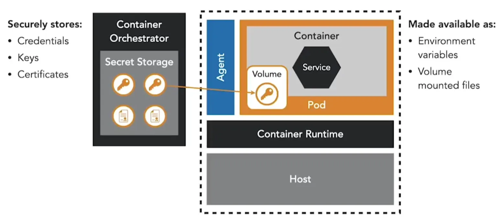

Microservices often require secrets such as credentials, database passwords, and SSL certificates. Storing them insecurely (hard-coded in source code, baked into images, or exposed in environment variables) creates serious risks, as attackers can extract them from repositories, registries, or hosts.

Container orchestrators like Kubernetes and OpenShift provide built-in secrets management, eliminating the need to embed secrets in images. Secrets can be injected into pods as environment variables or mounted as files in volumes, with file mounts being the more secure option. These approaches, however, are limited to the orchestrator’s cluster.

**Vault by HashiCorp** is a dedicated secrets management platform that extends beyond a single cluster. Microservices can retrieve secrets through Vault’s API or use a Vault Agent sidecar that integrates with orchestrators, handling authentication and injecting secrets into configuration files without extra application code.

Vault also supports **dynamic secrets**, which rotate automatically, reducing the risk of long-lived credentials. With leases, short-lived credentials are issued each time access is requested, further limiting exposure if a secret is compromised.

<small> Source: [LinkedIn Learning: Securing Microservices](https://www.linkedin.com/learning/microservices-security/securing-microservices?contextUrn=urn%3Ali%3AlyndaLearningPath%3A645bcd56498e6459e79b3c71&resume=false&u=57075649)</small>