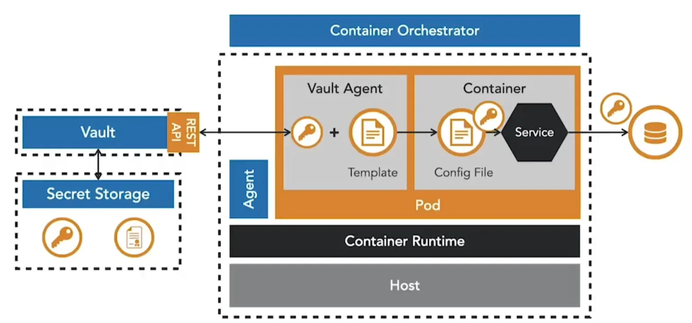
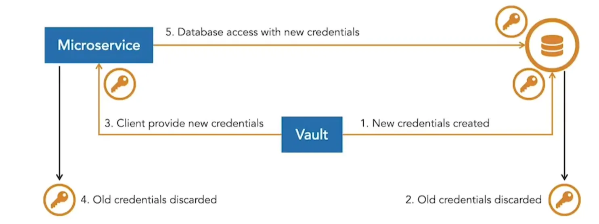

I microservizi spesso richiedono secrets come credenziali, password di database e certificati SSL. Conservarli in modo non sicuro (hardcoded nel codice sorgente, integrati nelle immagini o esposti nelle variabili d’ambiente) crea gravi rischi, poiché gli aggressori possono estrarli da repository, registri o host.

Gli orchestratori di container come Kubernetes e OpenShift forniscono una gestione integrata dei secrets, eliminando la necessità di inserirli nelle immagini. I secrets possono essere iniettati nei pod come variabili d’ambiente o montati come file nei volumi, con i file mount che rappresentano l’opzione più sicura. Questi approcci, tuttavia, sono limitati al cluster dell’orchestratore.

**Vault di HashiCorp** è una piattaforma dedicata alla gestione dei secrets che va oltre un singolo cluster. I microservizi possono recuperare i secrets tramite l’API di Vault o utilizzare un sidecar Vault Agent che si integra con gli orchestratori, gestendo l’autenticazione e iniettando i secrets nei file di configurazione senza codice applicativo aggiuntivo.

Vault supporta anche i secrets dinamici, che ruotano automaticamente, riducendo il rischio di credenziali a lunga durata. Con i lease, vengono emesse credenziali a breve durata ogni volta che viene richiesta un’autorizzazione, limitando ulteriormente l’esposizione se un secret viene compromesso.

<small> Fonte: [LinkedIn Learning: Securing Microservices](https://www.linkedin.com/learning/microservices-security/securing-microservices?contextUrn=urn%3Ali%3AlyndaLearningPath%3A645bcd56498e6459e79b3c71&resume=false&u=57075649)</small>