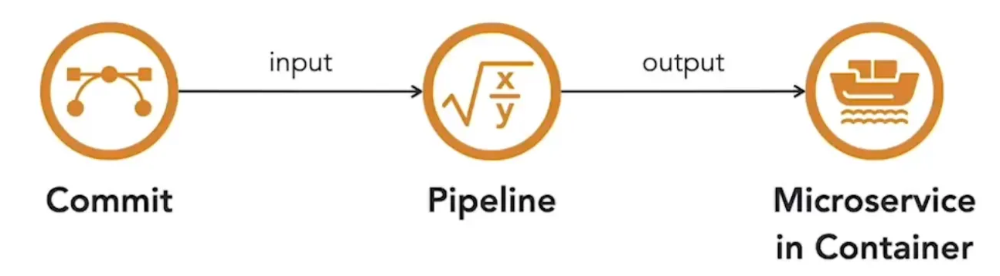

En pipeline kan ses som en funktion: den tager udvikler-commits som input og producerer i bedste fald en kørende container med den opdaterede software som output.  

Mellem disse to punkter er der flere trin. Når kode committes, trigges CI (Continuous Integration)-pipen. Den bygger og tester softwaren, pakker den derefter i et container-image og gemmer det i et artefakt-repository. Senere henter CD (Continuous Delivery)-pipen dette image og deployer det til container-runtime med en orchestrator. Undervejs kan automatiserede sikkerhedskontroller indsættes som gates for at forhindre, at sårbar kode eller images når produktion. Tidlig detektion og rettelse reducerer risikoen for, at problemer bevæger sig nedstrøms.  

Sikkerhed begynder i udviklingen. Statiske kodeanalyseværktøjer på udviklermaskiner fremhæver problemer, før koden når repositoryet. CI-buildet bør også køre statisk analyse og fejle builds, der ikke lever op til sikkerhedsstandarder. Adgang til kildekoderepositoryet bør begrænses til bidragsydere, med pull-request-modellen på plads. Værktøjer som Snyk gør det muligt at indlejre sikkerhedsscanninger i pull requests og levere feedback før merge.  

Når microservices bygges, bør tredjepartsbiblioteker hentes fra et betroet artefakt-repository, så kun godkendte afhængigheder og images anvendes. Efter buildet giver enheds- og integrationstests mulighed for interaktiv sikkerhedstest, som finder problemer under kodekørsel.  

Hvis tests lykkes, bygges microservice til et container-image og placeres i artefakt-repositoryet. Registry-scannere, ofte indbygget i repositories, finder sårbarheder, der opdages efter et image er skabt. Adgangen til repositoryet bør beskyttes nøje for at forhindre omgåelse af pipeline-sikkerhedskontroller.  

Når CI er afsluttet, deployer CD-pipen microservice-images til lavere miljøer for yderligere tests. Streng versionskontrol sikrer, at kun godkendte artefakter frigives. De samme kontroller gælder før produktionsrelease. I staging- eller lavere miljøer udføres dynamisk sikkerhedstest såsom automatiske penetrationstests, der leder efter kendte sårbarheder. Disse værktøjer integreres i pipen og blokerer sårbare images i at komme videre.  

Automatiserede scanninger bør tilpasses til at fokusere på kritiske sårbarheder. For mange falske positiver skaber alarmtræthed og sinker udviklingen. Velplacerede kontroller og præcise scanninger opretholder release-hastighed og sikrer sikkerhed.  

<small>Kilde: [LinkedIn Learning: Securing Microservices](https://www.linkedin.com/learning/microservices-security/securing-microservices?contextUrn=urn%3Ali%3AlyndaLearningPath%3A645bcd56498e6459e79b3c71&resume=false&u=57075649)</small>