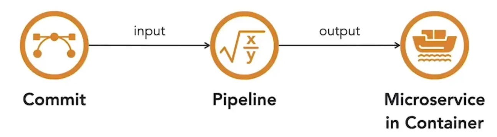
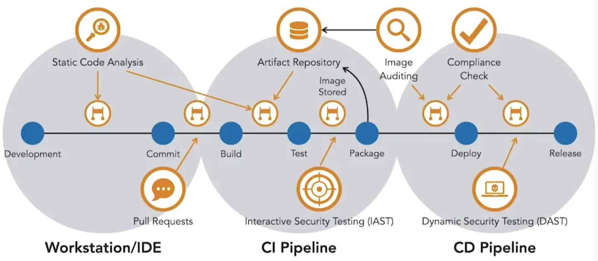

A pipeline can be seen as a function: it accepts developer commits as inputs and, in the ideal case, produces a running container with the updated software as output.  

Between these two points, several steps occur. When code is committed, the **CI (Continuous Integration)** pipeline is triggered. This builds and tests the software, then packages it into a container image and stores it in an artifact repository. The **CD (Continuous Delivery)** pipeline later pulls this image and deploys it onto the container runtime using an orchestrator. Along the way, automated security controls can be introduced as gates to prevent vulnerable code or images from reaching production. Detecting and correcting vulnerabilities early reduces the risk of them moving downstream.  

Security begins at development. Static code analysis tools on developer workstations highlight issues before code reaches the repository. The CI build should also run static analysis and fail builds that do not meet security standards. Access to the source repository should be limited to contributors, with a pull request model in place. Tools such as Snyk allow security scans to be embedded in pull requests, providing feedback before merging.  

When microservices are built, third-party libraries should come from a trusted artifact repository, ensuring only approved dependencies and images are used. After the build, unit and integration tests provide an opportunity for **interactive security testing**, which detects issues during code execution.  

If tests succeed, the microservice is built into a container image and placed in the artifact repository. Registry scanners, often built into repositories, detect vulnerabilities discovered after the image was created. Access to the repository should be closely guarded to prevent bypassing of pipeline security gates.  

Once CI completes, the CD pipeline deploys microservice images to lower environments for further testing. Strict version controls ensure only vetted artifacts are released. The same controls apply before production release. In staging or lower environments, **dynamic security testing** such as automated penetration tests probe for known vulnerabilities. These tools integrate with the pipeline to block vulnerable images from progressing.  

Automated scans should be tuned to focus on critical vulnerabilities. Excessive false positives create alert fatigue and slow development. Well-placed controls and accurate scans maintain release velocity while ensuring security.  

<small>Source: [LinkedIn Learning: Securing Microservices](https://www.linkedin.com/learning/microservices-security/securing-microservices?contextUrn=urn%3Ali%3AlyndaLearningPath%3A645bcd56498e6459e79b3c71&resume=false&u=57075649)</small>