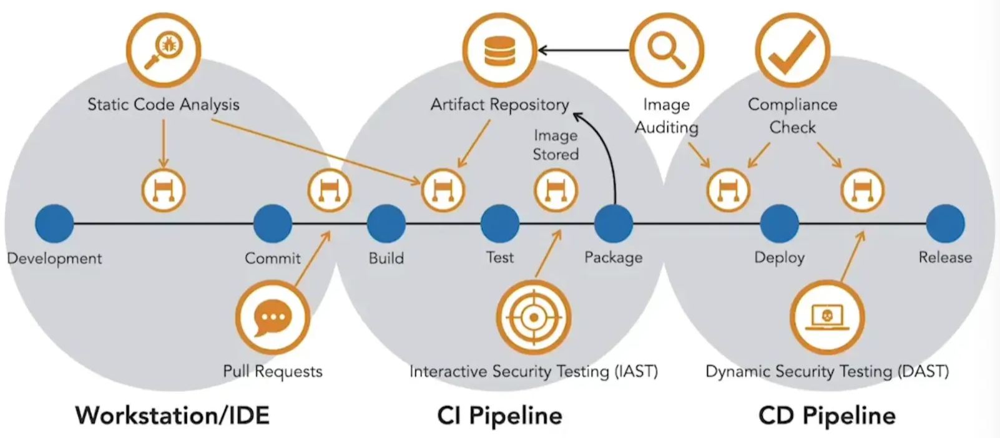

Una pipeline può essere vista come una funzione: accetta i commit degli sviluppatori come input e, nel caso ideale, produce come output un container in esecuzione con il software aggiornato.  

Tra questi due punti avvengono diversi passaggi. Quando il codice viene commitato, si attiva la pipeline di CI (Continuous Integration). Questa compila e testa il software, lo pacchettizza in un’immagine container e lo archivia in un repository di artefatti. Successivamente, la pipeline di CD (Continuous Delivery) recupera questa immagine e la distribuisce sul runtime dei container tramite un orchestratore. Durante il processo, controlli di sicurezza automatizzati possono essere inseriti come gate per impedire che codice o immagini vulnerabili arrivino in produzione. Rilevare e correggere le vulnerabilità precocemente riduce il rischio che si propaghino a valle.  

La sicurezza inizia nello sviluppo. Strumenti di analisi statica del codice sui workstation degli sviluppatori evidenziano i problemi prima che il codice raggiunga il repository. Anche la build di CI dovrebbe eseguire l’analisi statica e fallire le build che non soddisfano gli standard di sicurezza. L’accesso al repository sorgente dovrebbe essere limitato ai contributori, con un modello di pull request in atto. Strumenti come Snyk consentono di integrare le scansioni di sicurezza nelle pull request, fornendo feedback prima del merge.  

Quando si costruiscono microservizi, le librerie di terze parti dovrebbero provenire da un repository di artefatti affidabile, garantendo che vengano utilizzate solo dipendenze e immagini approvate. Dopo la build, i test unitari e di integrazione offrono l’opportunità di eseguire test di sicurezza interattivi, che rilevano problemi durante l’esecuzione del codice.  

Se i test hanno esito positivo, il microservizio viene costruito in un’immagine container e inserito nel repository di artefatti. Scanner di registry, spesso integrati nei repository, rilevano le vulnerabilità scoperte dopo la creazione dell’immagine. L’accesso al repository deve essere strettamente protetto per evitare l’aggiramento dei gate di sicurezza della pipeline.  

Una volta completata la CI, la pipeline di CD distribuisce le immagini dei microservizi negli ambienti inferiori per ulteriori test. Rigorosi controlli di versione garantiscono che vengano rilasciati solo artefatti verificati. Gli stessi controlli si applicano prima del rilascio in produzione. Negli ambienti di staging o inferiori, i test di sicurezza dinamici, come i penetration test automatizzati, verificano la presenza di vulnerabilità note. Questi strumenti si integrano con la pipeline per bloccare le immagini vulnerabili.  

Le scansioni automatizzate devono essere calibrate per concentrarsi sulle vulnerabilità critiche. Troppi falsi positivi creano fatica da allerta e rallentano lo sviluppo. Controlli ben posizionati e scansioni accurate mantengono la velocità di rilascio garantendo al contempo la sicurezza.  

<small>Fonte: [LinkedIn Learning: Securing Microservices](https://www.linkedin.com/learning/microservices-security/securing-microservices?contextUrn=urn%3Ali%3AlyndaLearningPath%3A645bcd56498e6459e79b3c71&resume=false&u=57075649)</small>