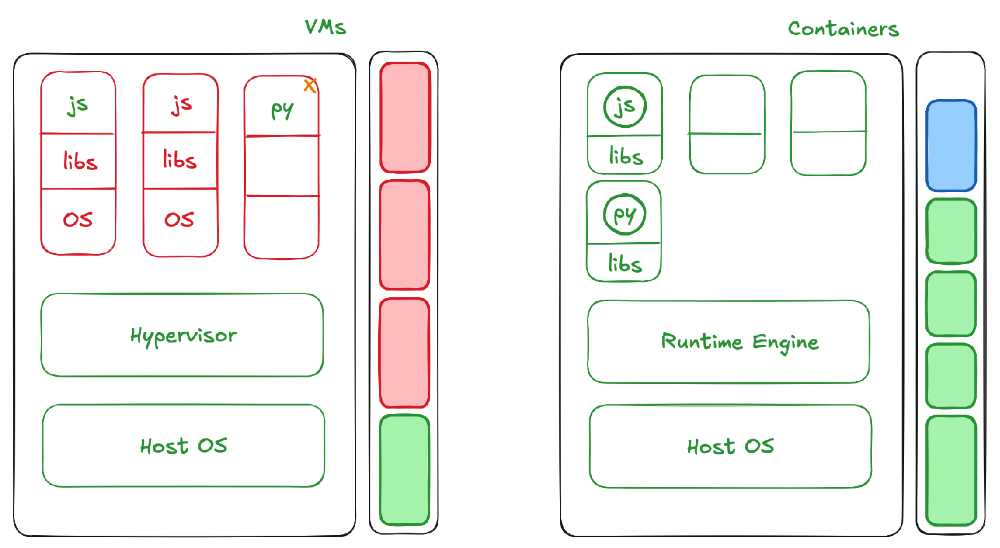

Der er en 3-trins proces, når man arbejder med containere og enten opretter eller pusher dem:
1. Manifest – noget, der beskriver selve containeren (i Docker en Dockerfile, i Cloud Foundry et manifest YAML)  
2. Opret selve imaget (i Docker et Docker image, i Rocket en ACI (Application Container Image))  
3. Push til et registry, så vi har containeren, der indeholder alle de nødvendige runtimes, biblioteker og binære filer til at køre en applikation  

Applikationen kører oven på følgende opsætning:
- Host OS  
- Runtime engine (f.eks. Docker engine – noget, der kører containerne)  
⇒ Det har forbrugt en mængde ressourcer  

Dette vil være meget mere letvægts end VM’er. Da man ikke skal bekymre sig om et gæste-OS, har vi kun bibliotekerne og selve applikationen. Fordi vi ikke behøver at duplikere operativsystem-afhængigheder og oprette VM’er, bruger vi færre ressourcer.  
⇒ Vi har derfor stadig en god mængde ressourcer tilbage  

Hvis containerprocesserne ikke bruger CPU eller hukommelse, bliver alle de delte ressourcer tilgængelige for de andre containere, der kører på den samme hardware.

<small> Kilde: [YouTube](https://www.youtube.com/watch?v=0qotVMX-J5s)</small>