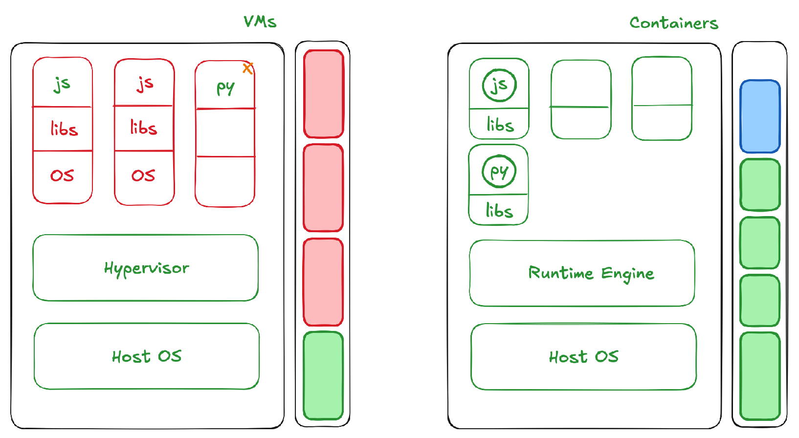

There’s a 3-step process when doing anything container-related and pushing or creating containers:
1. Manifest, something that describes the container itself (in Docker a Dockerfile, in Cloud Foundry a manifest YAML)  
2. Create the actual image (in Docker a Docker image, in Rocket an ACI (Application Container Image))  
3. Push this to a registry and we have the container itself that contains all of the runtimes and libraries and binaries needed to run an application  

That application runs on the following setup:
- Host OS  
- Runtime engine (e.g. Docker engine, it’s something that runs those containers)  
⇒ That has consumed some set of ressources  

This will be much more lightweight than VMs. Since you don’t have to worry about a guest OS, we just have the libraries and the application itself. Because we don’t have to duplicate operating system dependencies and create the VMs, we will use less ressources.  
⇒ We still have a good amount of ressources left  

If the container processes aren’t utilizing the CPU or memory, all the shared ressources become accessible for the other containers running within that hardware.

<small> Source: [YouTube](https://www.youtube.com/watch?v=0qotVMX-J5s)</small>