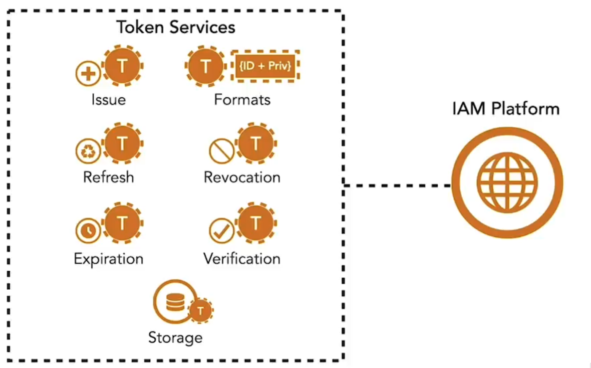

**IAM Platform capabilities:**

- **Authentication:** Supports various strategies to verify the identity of end users and clients  
- **Identity Management:** Management of identity attributes and access privileges of various parties including end users and clients  
- **Standards implementations:** Provides implementations for widely adopted standards for access control, identity verification, and client registration  
- **Token management:** Delivers capabilities to issue, revoke, and introspect tokens using various encoding formats.  

Leading platforms integrate with various identity stores to authenticate users. These stores hold credentials and permissions used for access control, ranging from local databases to corporate apps or social logins. For sensitive cases, multi-factor authentication adds a second factor, such as a one-time pin or biometrics.  

These solutions are also great sources for implementations of security standards and protocols used by microservices, such as OAuth2, OpenID Connect, and JSON Web Token.  

The image below illustrates the **token services of an IAM platform**, showing how tokens are issued, refreshed, expired, revoked, verified, stored, and formatted to support authentication and access control.  

<small> Source: [LinkedIn Learning: Securing Microservices](https://www.linkedin.com/learning/microservices-security/securing-microservices?contextUrn=urn%3Ali%3AlyndaLearningPath%3A645bcd56498e6459e79b3c71&resume=false&u=57075649)</small>