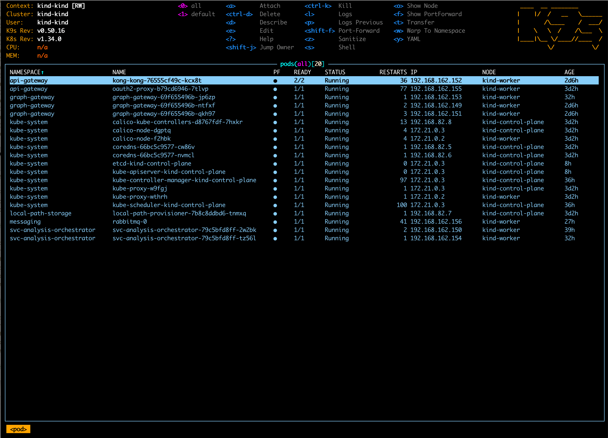
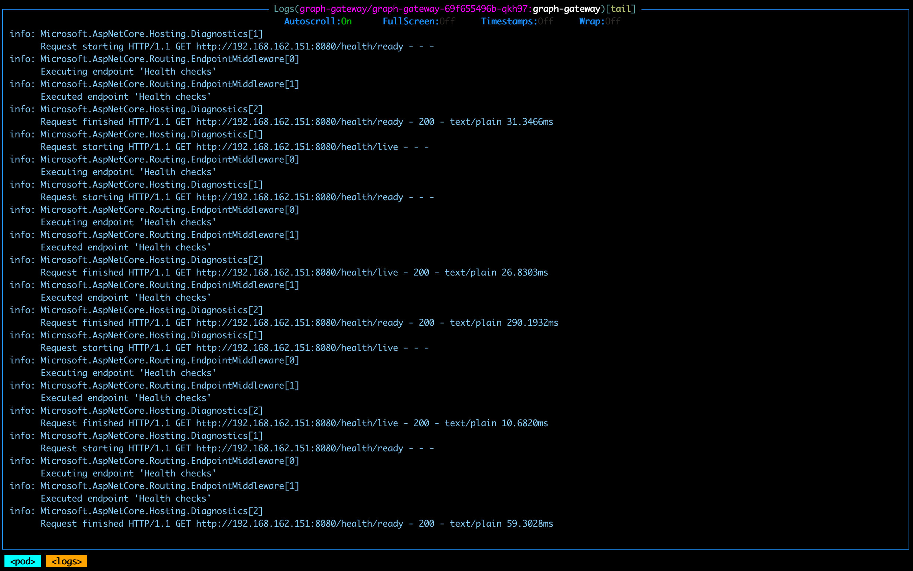

k9s semplifica la navigazione, l’osservazione e la gestione dei cluster Kubernetes tramite un’interfaccia basata su terminale. Fornisce una panoramica unificata di pods, deployments, Helm releases, services, namespaces e network policies, e rende semplice ispezionare le risorse, seguire i log in tempo reale e riavviare o eliminare risorse.

**Esempio: Pods in k9s**  

**Esempio: Describe in k9s**  

**Esempio: Logs in k9s**  

<small>Fonte: [k9s Documentation](https://k9scli.io/)</small>