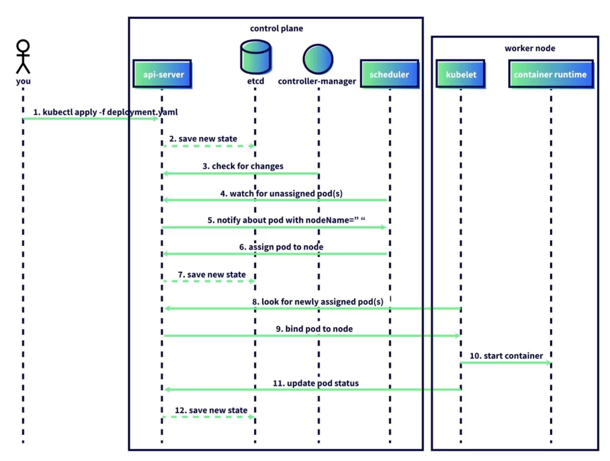

A sequence diagram illustrates the order of actions in Kubernetes when a Pod is scheduled onto a node. While this is a simplified view, it highlights the key steps in how the control plane and worker nodes interact.

##### Process Overview
1. A user runs `kubectl apply -f deployment.yaml`.  
2. The API server saves the new deployment state in etcd.  
3. The controller manager checks the API server for changes.  
4. The scheduler looks for newly created Pods without node assignments.  
5. The API server notifies the scheduler of a pending Pod.  
6. The scheduler assigns the Pod to a node and reports back to the API server.  
7. The API server updates etcd with the new state.  
8. The kubelet on the chosen worker node checks the API server for newly assigned Pods.  
9. The API server provides the Pod specification, binding the Pod to the node.  
10. The kubelet pulls the container image and starts the container using the container runtime.  
11. The kubelet updates the Pod status (healthy or unhealthy) with the API server.  
12. The API server saves the Pod status in etcd.  

##### Summary
This process demonstrates how Kubernetes components work together to ensure Pods are scheduled, created, and monitored. The API server acts as the central hub, continually handling hundreds or thousands of requests to keep the cluster running smoothly.

<small> Source: [LinkedIn Learning: Learning Kubernetes](https://www.linkedin.com/learning/learning-kubernetes-16086900)</small>