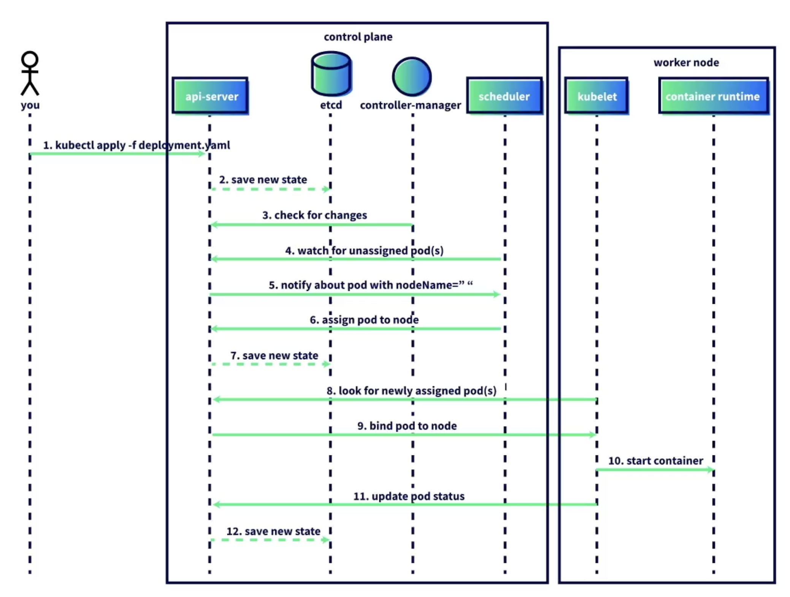

Un diagramma di sequenza illustra l’ordine delle azioni in Kubernetes quando un Pod viene assegnato a un node. Pur essendo una visione semplificata, evidenzia i passaggi chiave di come il control plane e i worker nodes interagiscono.

##### Panoramica del processo
1. Un utente esegue `kubectl apply -f deployment.yaml`.  
2. L’API server salva il nuovo stato del deployment in etcd.  
3. Il controller manager controlla l’API server per eventuali modifiche.  
4. Lo scheduler cerca i Pods appena creati senza assegnazione a un node.  
5. L’API server notifica allo scheduler un Pod in sospeso.  
6. Lo scheduler assegna il Pod a un node e riporta l’informazione all’API server.  
7. L’API server aggiorna etcd con il nuovo stato.  
8. Il kubelet sul worker node scelto controlla l’API server per i Pods appena assegnati.  
9. L’API server fornisce la specifica del Pod, vincolandolo al node.  
10. Il kubelet scarica l’immagine del container e avvia il container tramite il container runtime.  
11. Il kubelet aggiorna lo stato del Pod (healthy o unhealthy) con l’API server.  
12. L’API server salva lo stato del Pod in etcd.  

##### Riepilogo
Questo processo dimostra come i componenti di Kubernetes lavorano insieme per garantire che i Pods vengano assegnati a un node, creati e monitorati. L’API server agisce come hub centrale, gestendo continuamente centinaia o migliaia di richieste per mantenere il cluster in esecuzione senza problemi.

<small>Fonte: [LinkedIn Learning: Learning Kubernetes](https://www.linkedin.com/learning/learning-kubernetes-16086900)</small>