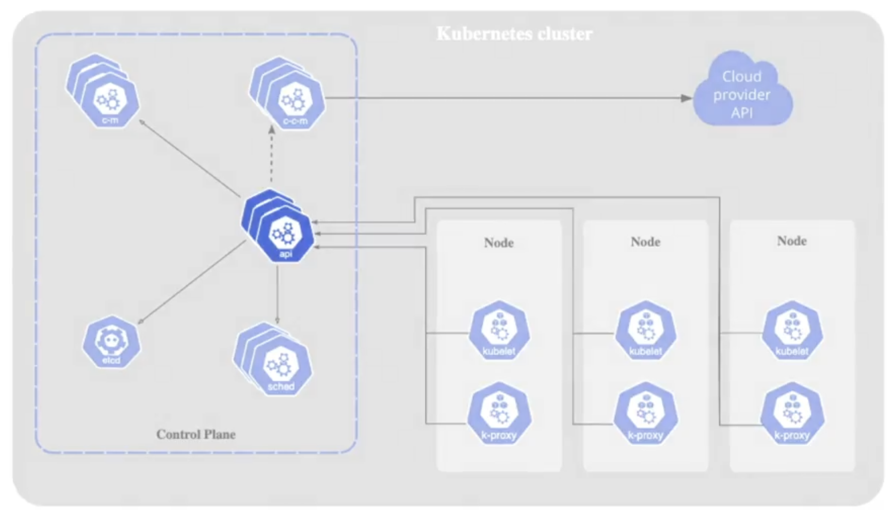
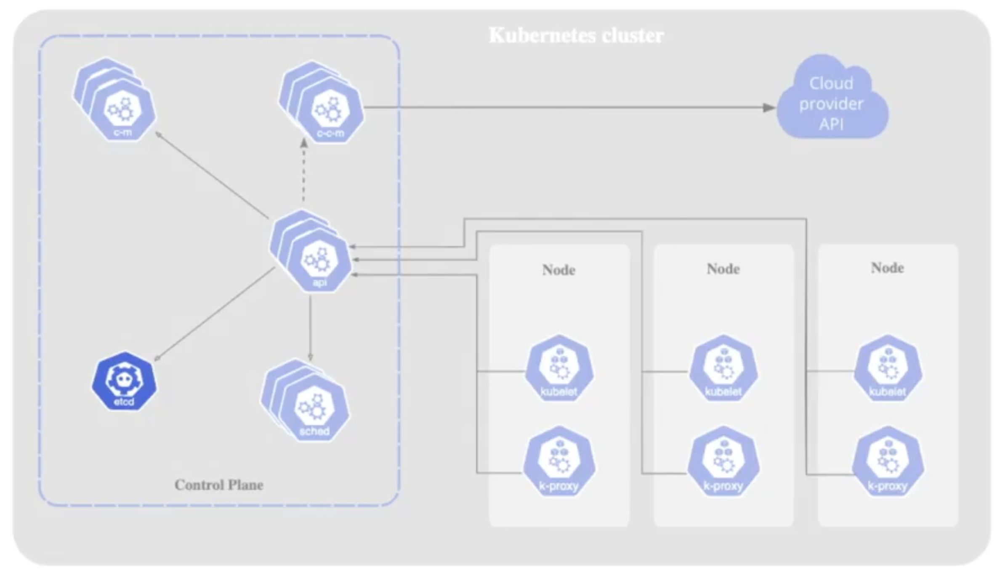
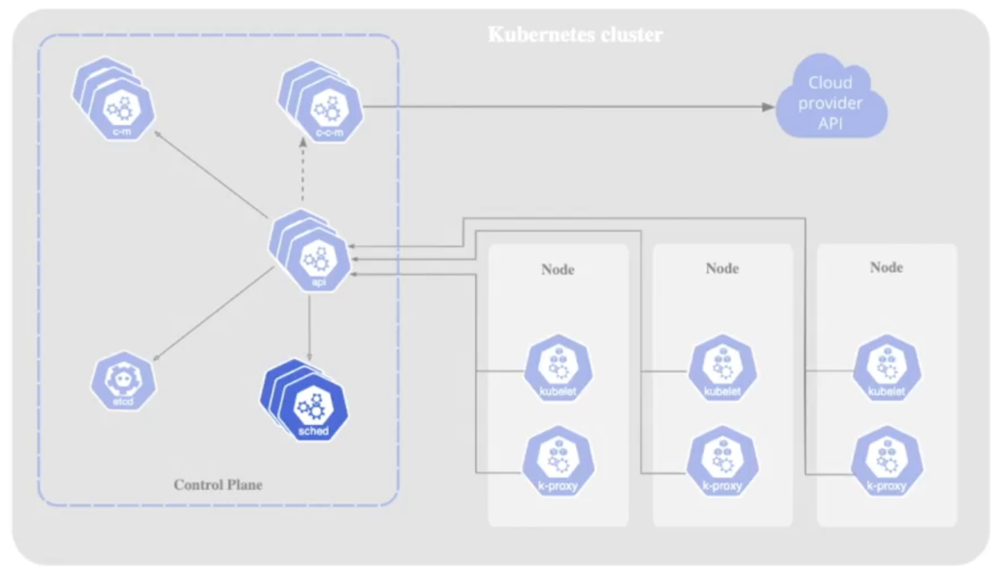
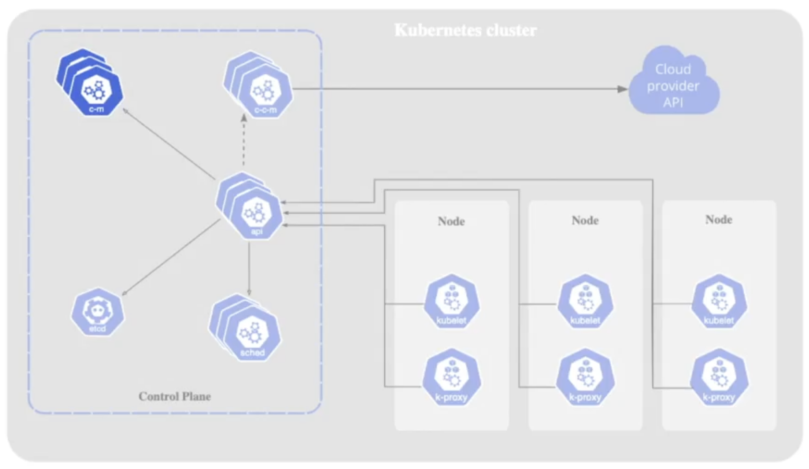
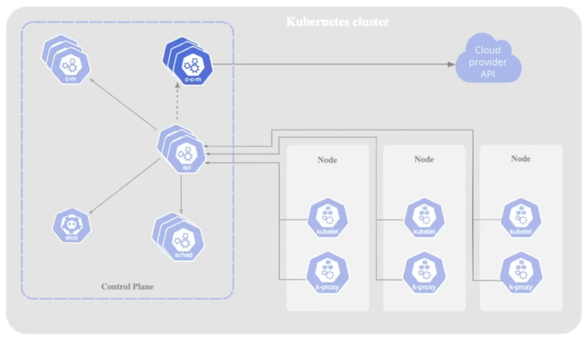

Et Kubernetes-cluster består af en control plane og mindst én worker node. Control plane fungerer som et kontroltårn i en lufthavn og styrer clusteret for at sikre, at nodes og Pods bliver oprettet, planlagt og vedligeholdt korrekt. Dets komponenter leverer den robusthed og automatisering, der gør Kubernetes til en effektiv container-orchestrator.

##### Note
I managed services som Amazon EKS eller Google GKE er control plane-komponenter skjult, da cloud-udbyderen vedligeholder dem.

##### Kube API Server
API-serveren eksponerer Kubernetes API’et, som giver endpoints til alle Kubernetes-objects såsom Pods, Deployments og Horizontal Pod Autoscaler.  

- Kommunikerer via et REST-interface, hvor værktøjer som kubectl og kubeadm sender HTTP-forespørgsler.  
- For at se tilgængelige ressourcer, kør `kubectl api-resources`.  
- Kører som en Pod i kube-system-namespace, typisk med kube-apiserver som præfiks. Pods i dette namespace kan listes med `kubectl -n kube-system get pods`.  
- Håndterer flest forespørgsler både fra brugere og internt i clusteret. Uden den kan et Kubernetes-cluster ikke fungere.  

##### etcd
Etcd er en open source, højtilgængelig key–value store, der gemmer al cluster state-data.  

- Kun Kube API-serveren kommunikerer direkte med etcd.  
- Kører som en Pod i kube-system-namespace.  
- Logs kan ses ved at finde etcd-Pod’en og køre `kubectl logs <etcd-pod> -n kube-system`.  

##### Kube Scheduler
Scheduleren identificerer nyligt oprettede Pods uden en worker node-tildeling og vælger en passende node til dem.  

- Kører som en Pod i kube-system-namespace.  
- Adfærden kan udforskes ved at beskrive Pod’en eller inspicere dens logs.  

##### Kube Controller Manager
Controller manager kører kontinuerlige loops, der opretholder den ønskede tilstand af clusteret.  

- Sikrer, at worker nodes er sunde; erstatter dem, hvis de fejler.  
- Håndterer forskellige controllere, som udligner forskelle mellem clusterets tilstand og den deklarerede konfiguration.  

##### Cloud Controller Manager
Denne komponent integrerer Kubernetes med eksterne cloud-udbyderes API’er.  

- Muliggør brug af ressourcer fra udbydere som AWS, GCP eller Azure.  
- Understøtter cluster-operationer, der afhænger af cloud-infrastruktur.  

<small>Kilde: [LinkedIn Learning: Learning Kubernetes](https://www.linkedin.com/learning/learning-kubernetes-16086900)</small>