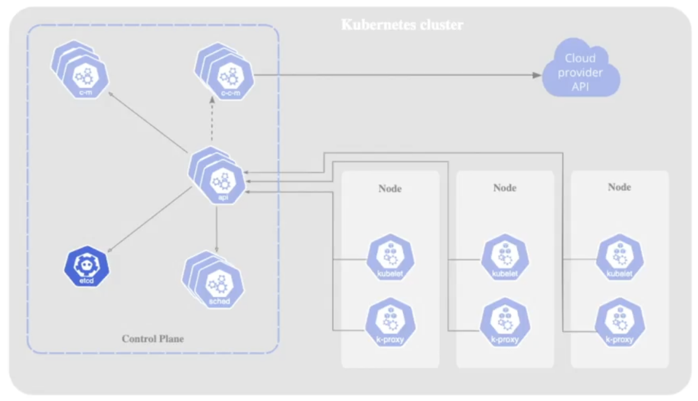
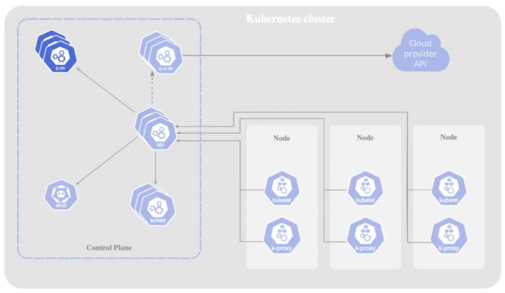

A Kubernetes cluster consists of a control plane and at least one worker node. The control plane acts like the air traffic control tower of an airport, managing the cluster to ensure that nodes and Pods are created, scheduled, and maintained correctly. Its components provide the resiliency and automation that make Kubernetes an effective container orchestrator.

>**Note:** In managed services such as Amazon EKS or Google GKE, control plane components are hidden, as the cloud provider maintains them.

##### Kube API Server
The API server exposes the Kubernetes API, which provides endpoints for all Kubernetes objects such as Pods, Deployments, and the Horizontal Pod Autoscaler.  

- Communicates via a REST interface, with tools like kubectl and kubeadm sending HTTP requests.  
- To view available resources, run `kubectl api-resources`.  
- Runs as a Pod in the kube-system namespace, typically with kube-apiserver as the prefix. The Pods in this namespace can be listed with `kubectl -n kube-system get pods`.  
- Handles the most requests both from users and within the cluster. Without it, a Kubernetes cluster cannot function.  

##### etcd
Etcd is an open-source, highly available key–value store that saves all cluster state data.  

- Only the Kube API server communicates directly with etcd.  
- Runs as a Pod in the kube-system namespace.  
- Logs can be viewed by finding the etcd Pod and running `kubectl logs <etcd-pod> -n kube-system`.  

##### Kube Scheduler
The scheduler identifies newly created Pods that lack a worker node assignment and selects an appropriate node for them.  

- Runs as a Pod in the kube-system namespace.  
- Behavior can be explored by describing the Pod or inspecting its logs.  

##### Kube Controller Manager
The controller manager runs continuous loops that maintain the desired state of the cluster.  

- Ensures worker nodes are healthy; replaces them if they fail.  
- Manages various controllers that reconcile cluster state with the declared configuration.  

##### Cloud Controller Manager
This component integrates Kubernetes with external cloud provider APIs.  

- Enables use of resources from providers such as AWS, GCP, or Azure.  
- Facilitates cluster operations that depend on cloud infrastructure.  

<small> Source: [LinkedIn Learning: Learning Kubernetes](https://www.linkedin.com/learning/learning-kubernetes-16086900)</small>