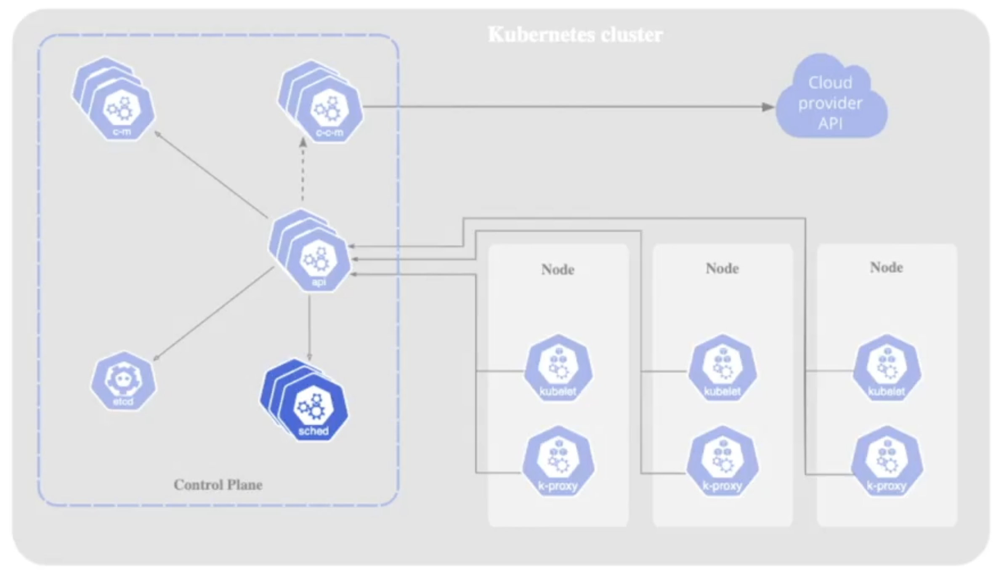

Un cluster Kubernetes è costituito da un control plane e almeno un worker node. Il control plane funziona come la torre di controllo di un aeroporto, gestendo il cluster per garantire che nodes e Pods vengano creati, pianificati e mantenuti correttamente. I suoi componenti forniscono la resilienza e l’automazione che rendono Kubernetes un orchestratore di container efficace.

##### Nota
Nei managed services come Amazon EKS o Google GKE, i componenti del control plane sono nascosti, poiché vengono gestiti dal cloud provider.

##### Kube API Server
L’API server espone le API di Kubernetes, che forniscono endpoints per tutti gli objects di Kubernetes come Pods, Deployments e Horizontal Pod Autoscaler.  

- Comunica tramite interfaccia REST, con strumenti come kubectl e kubeadm che inviano richieste HTTP.  
- Per visualizzare le risorse disponibili, eseguire `kubectl api-resources`.  
- Viene eseguito come Pod nel namespace kube-system, tipicamente con kube-apiserver come prefisso. I Pods in questo namespace possono essere elencati con `kubectl -n kube-system get pods`.  
- Gestisce il maggior numero di richieste sia dagli utenti che all’interno del cluster. Senza di esso, un cluster Kubernetes non può funzionare.  

##### etcd
Etcd è un key–value store open source e altamente disponibile che salva tutti i dati sullo stato del cluster.  

- Solo il Kube API server comunica direttamente con etcd.  
- Viene eseguito come Pod nel namespace kube-system.  
- I log possono essere visualizzati trovando il Pod etcd ed eseguendo `kubectl logs <etcd-pod> -n kube-system`.  

##### Kube Scheduler
Lo scheduler identifica i Pods appena creati che non hanno un’assegnazione a un worker node e seleziona un node appropriato per loro.  

- Viene eseguito come Pod nel namespace kube-system.  
- Il comportamento può essere esplorato descrivendo il Pod o ispezionando i suoi log.  

##### Kube Controller Manager
Il controller manager esegue cicli continui che mantengono lo stato desiderato del cluster.  

- Garantisce che i worker nodes siano in salute; li sostituisce in caso di guasto.  
- Gestisce vari controller che riconciliano lo stato del cluster con la configurazione dichiarata.  

##### Cloud Controller Manager
Questo componente integra Kubernetes con le API dei cloud provider esterni.  

- Abilita l’uso di risorse da provider come AWS, GCP o Azure.  
- Facilita le operazioni del cluster che dipendono dall’infrastruttura cloud.  

<small>Fonte: [LinkedIn Learning: Learning Kubernetes](https://www.linkedin.com/learning/learning-kubernetes-16086900)</small>