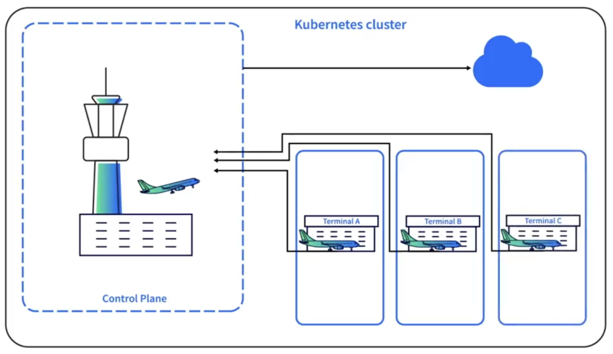

Hvis Kubernetes er som en lufthavn, er control plane kontroltårnet, mens worker nodes er de travle terminaler, hvor fly parkerer og passagerer går ombord. For at opretholde høj tilgængelighed kører de fleste clusters med mindst tre worker nodes. Worker nodes er stedet, hvor Pods tildeles en node og kører, og hver node har tre hovedkomponenter.

##### Kubelet
Kubelet er en agent, der kører på hver worker node. Den sikrer, at containere i Pods startes og forbliver sunde. Kubelet kommunikerer direkte med API-serveren i control plane og holder løbende øje med nyligt tildelte Pods.

##### Container Runtime
Container runtime er ansvarlig for at starte containere, når Kubelet tildeler en Pod. Dette håndteres via Container Runtime Interface (CRI), som understøtter engines som containerd, CRI-O, Kata Containers og AWS Firecracker. Siden Kubernetes v1.24 er Dockershim blevet fjernet, hvilket betyder, at Docker ikke længere er en understøttet runtime. Docker-images virker dog stadig i Kubernetes, fordi images og runtimes er adskilte koncepter.

##### Kube-proxy
Kube-proxy sikrer netværk i clusteret, så Pods og Services kan kommunikere på tværs af worker nodes og med control plane. Hver Kube-proxy kommunikerer direkte med API-serveren.

<small>Kilde: [LinkedIn Learning: Learning Kubernetes](https://www.linkedin.com/learning/learning-kubernetes-16086900)</small>