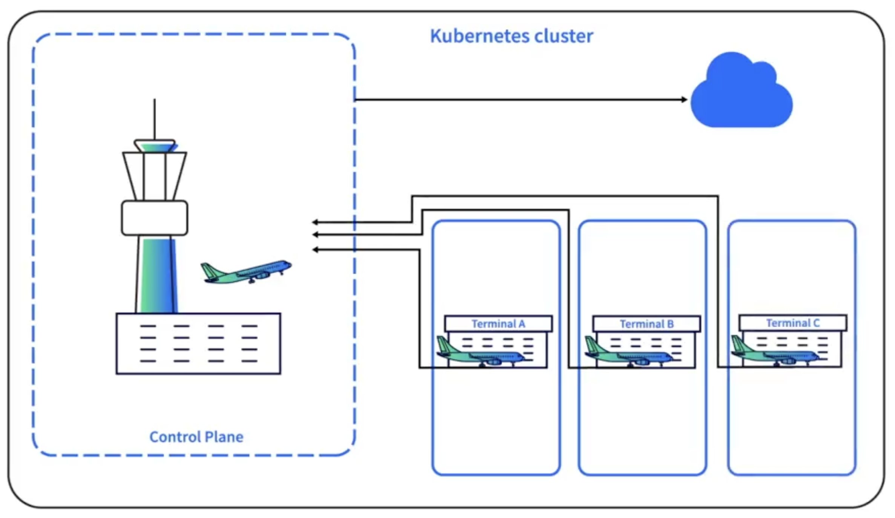

If Kubernetes is like an airport, the control plane is the air traffic control tower, and the worker nodes are the busy terminals where planes park and passengers board. To maintain high availability, most clusters run with at least three worker nodes. Worker nodes are where Pods are scheduled and run, and each node has three main components.

##### Kubelet
The Kubelet is an agent that runs on every worker node. It ensures that containers in Pods are started and remain healthy. The Kubelet communicates directly with the API server in the control plane and continuously looks for newly assigned Pods.

##### Container Runtime
The container runtime is responsible for starting containers once the Kubelet assigns a Pod. This is handled through the Container Runtime Interface (CRI), which supports engines such as containerd, CRI-O, Kata Containers, and AWS Firecracker. Since Kubernetes v1.24, the Dockershim has been removed, meaning Docker itself is no longer a supported runtime. However, Docker images still work in Kubernetes because images and runtimes are separate concepts.

##### Kube-proxy
The Kube-proxy ensures networking within the cluster, enabling Pods and Services to communicate across worker nodes and with the control plane. Each Kube-proxy communicates directly with the API server.

<small> Source: [LinkedIn Learning: Learning Kubernetes](https://www.linkedin.com/learning/learning-kubernetes-16086900)</small>