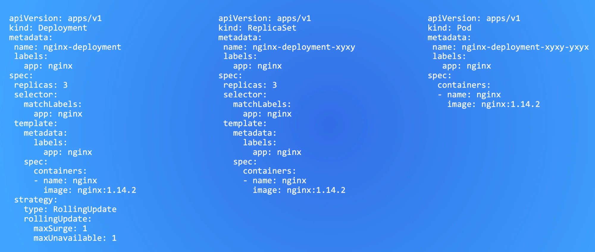

### Kubernetes Manifests

Kubernetes-manifester bruges til at beskrive den ønskede tilstand for workloads i et cluster. De er deklarative YAML-filer, som Kubernetes kontrollerer og sørger for altid matcher den aktuelle tilstand. Tre af de mest grundlæggende ressourcer er Pods, ReplicaSets og Deployments.

**Pod**

En Pod er den mindste deploybare enhed i Kubernetes og indeholder én eller flere containere. I microservices-arkitekturer anvender man næsten altid et 1:1-forhold, hvor en pod kun indeholder én container, fordi microservices holdes adskilt og er lette at skalere individuelt.

På illustrationen til højre ses et eksempel på et Pod-manifest, som beskriver en nginx-container. Under metadata angives navn, labels og eventuelt namespace. Nginx fungerer her som en almindelig webserver, der kører i containeren.

**ReplicaSet**

Et ReplicaSet har til opgave at sikre, at et bestemt antal pods, defineret i feltet replicas, til enhver tid er kørende. Hvis en pod fejler, opretter ReplicaSet automatisk en ny for at opretholde det ønskede antal.

Manifestet i midten viser et ReplicaSet med tre replicas, hvilket svarer til tre identiske pods.

**Deployment**

Et Deployment styrer et eller flere ReplicaSets og definerer strategien for, hvordan pods skal opdateres. Manifestet til venstre viser et Deployment, der igen beskriver tre replicas af en nginx-pod.

Forskellen mellem Deployment og ReplicaSet er, at Deployment indeholder opgraderingsstrategier, hvor ReplicaSet kun sørger for at holde x antal pods kørende.

I praksis opretter man næsten altid kun Deployment-manifestet. Kubernetes opretter automatisk både ReplicaSet og pods. Det anses som dårlig praksis at oprette pods direkte, fordi de ikke genskabes ved fejl. Et ReplicaSet kunne godt genskabe pods, men uden fordelene ved en opdateringsstrategi.

**Opdateringsstrategi**

I Deploymentet i eksemplet bruges strategien RollingUpdate. Den styrer, hvordan nye versioner af pods rulles ud. Indstillingerne:

- `maxUnavailable: 1` betyder, at højst én pod må være utilgængelig under en opdatering.
- `maxSurge: 1` betyder, at der midlertidigt må oprettes én ekstra pod.

Ved en opdatering kan der derfor kortvarigt være fire pods: én gammel, der er ved at blive termineret, én ny, der er ved at blive startet, og to eksisterende pods, der er fuldt funktionsdygtige. Dette giver en kontrolleret og stabil opdatering uden nedetid.