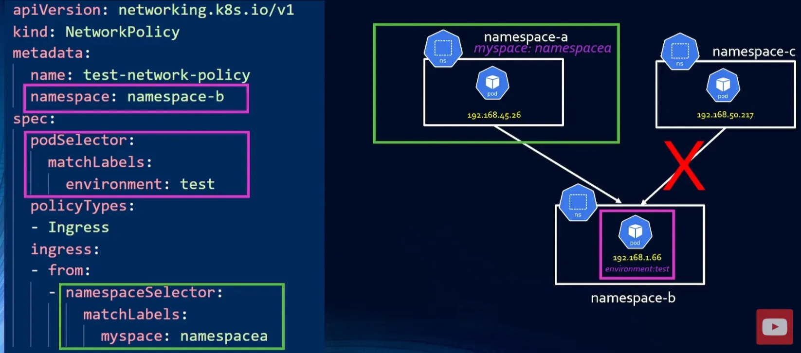
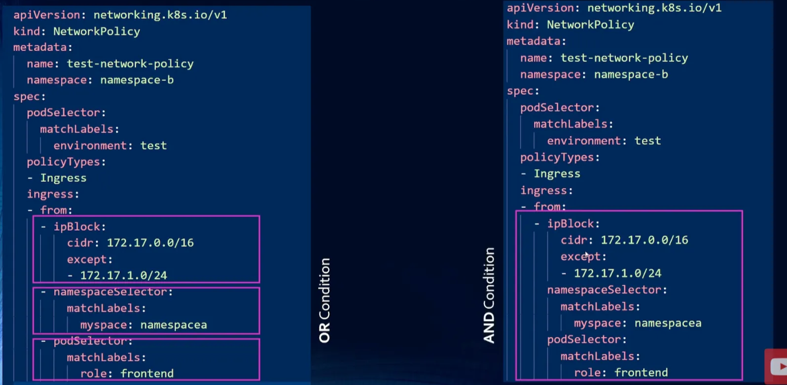

##### PolicyTypes

Esistono due tipi di regole NetworkPolicy:

- **Ingress:** Controlla quale traffico in entrata può raggiungere un pod.  
- **Egress:** Controlla quale traffico in uscita un pod può inviare.

##### Applicazione delle Network Policies

Una NetworkPolicy si applica solo ai pod all’interno del namespace in cui è definita.

I namespaces vengono selezionati con `namespaceSelector`, e i pod con `podSelector`. Con `ipBlock` è possibile limitare il traffico in base a intervalli IP. Le connessioni in ingresso o in uscita vengono controllate tramite le sorgenti o destinazioni specificate sotto `ingress:` o `egress:`.

Nell’esempio, namespace-b accetta traffico solo verso i pod con l’etichetta `environment: test` proveniente dai pod in namespace-a, perché `namespaceSelector` corrisponde all’etichetta `myspace: namespacea`.

Le Network Policies richiedono un network policy agent installato nel cluster per essere applicate. Questi agenti **non** vengono installati automaticamente in Kubernetes. Un esempio di CNI (Container Network Interface) che supporta le Network Policies è **Calico**. Una CNI definisce come i container si collegano alla rete e come plugin come Calico gestiscono il networking in Kubernetes.

##### Condizioni OR e AND

Le regole sotto `from:` o `to:` vengono interpretate in base alla struttura degli elementi della lista:

- **OR-condition:** Ogni insieme di criteri viene scritto come un elemento separato della lista (`-`). La sorgente deve soddisfare *uno* dei criteri elencati.  
- **AND-condition:** `ipBlock`, `namespaceSelector` e `podSelector` appaiono nello *stesso* elemento della lista. La sorgente deve soddisfare *tutti* i criteri di quell’elemento.

<small>Fonte: [Kubernetes Network Policy Tutorial](https://www.youtube.com/watch?v=u1KUft3fsCk)</small>