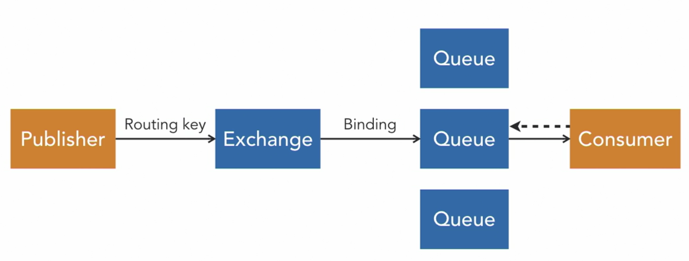

This is the model of how RabbitMQ is constructed:

Everything starts with an application that wants to send a message. This is called the publisher, or sometimes the producer.  

The publisher connects to a message broker, and publishes the message to an exchange. The publisher can also send a routing key along with the message.  

The exchange passes the message onto the queues. The exchange will use certain rules to determine which queue to route the message to. These rules are called bindings, and they can use the routing key that the publisher included.  

Finally, the message is sent to the receiving application, called the consumer. The broker will push the message to a subscribed consumer, but it’s also possible to have the consumers fetch or pull the messages on the mound. Multiple applications can be subscribed to the same queue, but only one of them will receive a single message.  

As a last step, this consumer will send a message acknowledgment back to the message broker. This signals the message broker to delete the message from the queue.  

##### Queue and Exchange Configuration
- **Durability**
    - Durability is not the same as persistence
    - A durable queue or exchange will survive a RabbitMQ restart, and transient ones will not.
        - This doesn’t mean that any undelivered messages are persisted. Unless you configure persistence, RabbitMQ keeps your messages in memory. This means they will be lost when the service restarts.
- **Auto-delete**
    - It is possible to tell an exchange or queue to delete itself if nothing is connected to it anymore
    - For example, a queue could automatically be removed when the last consumer disconnects.

<small> Source: [LinkedIn Learning: Learning RabbitMQ - Overview of RabbitMQ](https://www.linkedin.com/learning/learning-rabbitmq/overview-of-rabbitmq?resume=false&u=57075649)</small>