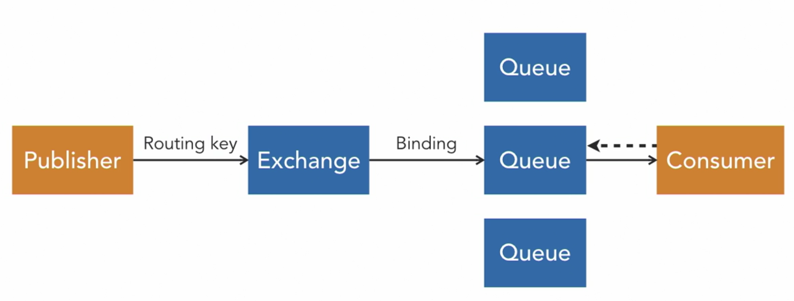

Questo è il modello di come è costruito RabbitMQ:  

Tutto inizia con un’applicazione che vuole inviare un messaggio. Questa è chiamata il publisher, o talvolta il produttore.  

Il publisher si connette a un message broker e pubblica il messaggio su un exchange. Il publisher può anche inviare una routing key insieme al messaggio.  

L’exchange inoltra il messaggio alle code. L’exchange utilizza determinate regole per stabilire a quale coda instradare il messaggio. Queste regole si chiamano binding e possono usare la routing key inclusa dal publisher.  

Infine, il messaggio viene inviato all’applicazione ricevente, chiamata consumer. Il broker invierà il messaggio a un consumer sottoscritto, ma è anche possibile che i consumer recuperino (pull) i messaggi. Più applicazioni possono essere sottoscritte alla stessa coda, ma solo una di esse riceverà un singolo messaggio.  

Come ultimo passo, il consumer invia un acknowledgment al message broker. Questo segnala al broker di eliminare il messaggio dalla coda.  

##### Configurazione di code ed exchange
- **Durabilità**
    - La durabilità non è la stessa cosa della persistenza  
    - Una coda o un exchange durevole sopravvive a un riavvio di RabbitMQ, mentre quelli transitori no.  
        - Questo non significa che i messaggi non consegnati vengano automaticamente persistiti. A meno che non venga configurata la persistenza, RabbitMQ mantiene i messaggi in memoria. Ciò significa che andranno persi quando il servizio viene riavviato.  
- **Auto-delete**
    - È possibile configurare un exchange o una coda in modo che si elimini automaticamente se non è più connesso a nulla.  
    - Ad esempio, una coda potrebbe essere rimossa automaticamente quando si disconnette l’ultimo consumer.  

<small>Fonte: [LinkedIn Learning: Learning RabbitMQ - Overview of RabbitMQ](https://www.linkedin.com/learning/learning-rabbitmq/overview-of-rabbitmq?resume=false&u=57075649)</small>