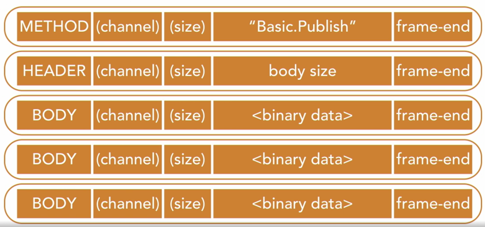

AMQP-protokollen er en binær protokol. Det betyder, at beskeder sendes i binært format.  

Når vi sender en enkelt besked over AMQP, sendes der flere frames: en metode-frame, en header-frame og mange body-frames.  
En enkelt frame består af:  
1. Første byte: **Type**  
    - Kan være method, header, body eller heartbeat.  
2. Anden byte: **Channel**  
    - Kanalen er en virtuel forbindelse. I AMQP-protokollen kan en klient have én fysisk forbindelse til message brokeren, men bruge den forbindelse til flere uafhængige tråde af beskeder. Disse tråde får hver deres kanal.  
3. Tredje byte: **Size**  
    - Dette tal angiver størrelsen af framens payload.  
4. Flere bytes, der indeholder **payloaden** af framen  
    - Antallet af bytes her svarer til størrelsen, der blev angivet i det forrige felt.  
    - Payloaden indeholder en værdi, der angiver den handling, vi vil udføre.  
        - Når vi sender en besked, kan den indeholde Basic.Publish.  
        - I en header-frame vil den indeholde detaljer såsom størrelsen på hele beskeden, vi skal sende.  
        - Payloaden i en body-frame vil indeholde selve byten(e), der repræsenterer beskeden.  
        - Heartbeat-framen bruges til at signalere, at afsenderen stadig er i live.  
5. Sidste byte: **Frame-end**  
    - En enkelt byte, der markerer slutningen på framen.  

<small>Kilde: [LinkedIn Learning: Learning RabbitMQ - The AMQP protocol](https://www.linkedin.com/learning/learning-rabbitmq/the-amqp-protocol?autoSkip=true&resume=false&u=57075649)</small>