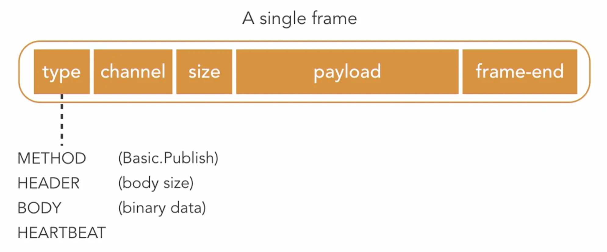

The AMQP protocol is a binary protocol. This means that messages are sent in binary format.

When we send a single message over AMQP, it will send multiple frames: A method frame, a header frame, and many body frames.  
A single frame consists of:
1. First byte: **Type**
    - Can be method, header, body, or heartbeat.
2. Second byte: **Channel**
    - The channel is a virtual connection. In the AMQP protocol, a client can have a single physical connection to the message broker, but use that connection for multiple independent threads of messages. These threads each get their own channel.
3. Third byte: **Size**
    - This number indicates the size of the frame’s payload
4. Multiple bytes containing the **payload** of the frame
    - The number of bytes used here is equal to the size that was put in the previous block
    - The payload contains a value indicating the action we want to perform.
        - In the case of sending a message, it could contain Basic.Publish.
        - In the header frame, it will contain details such as the size of the entire messaeg we will be sending.
        - The payload of the body frame will contain the byte that represents the actual message we will be sending.
        - The heartbeat frame is used to signal that the sender is still alive.
5. Last byte: **Frame-end**
    - A single byte that indicates the end of the frame

<small> Source: [LinkedIn Learning: Learning RabbitMQ - The AMQP protocol](https://www.linkedin.com/learning/learning-rabbitmq/the-amqp-protocol?autoSkip=true&resume=false&u=57075649)</small>