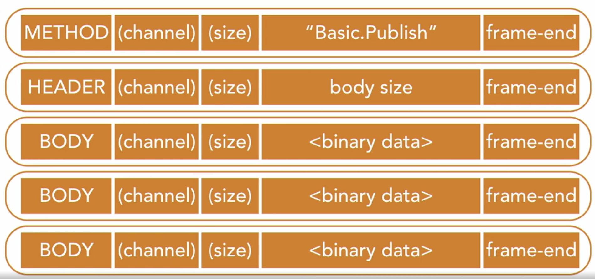
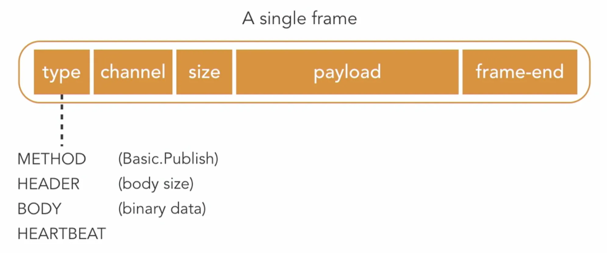

Il protocollo AMQP è un protocollo binario. Questo significa che i messaggi vengono inviati in formato binario.  

Quando inviamo un singolo messaggio tramite AMQP, vengono spediti più frame: un frame di metodo, un frame di header e molti frame di body.  
Un singolo frame è composto da:  
1. Primo byte: **Tipo**  
    - Può essere method, header, body oppure heartbeat.  
2. Secondo byte: **Canale**  
    - Il canale è una connessione virtuale. Nel protocollo AMQP, un client può avere una singola connessione fisica al message broker, ma usare quella connessione per più flussi indipendenti di messaggi. Questi flussi ricevono ciascuno il proprio canale.  
3. Terzo byte: **Dimensione**  
    - Questo numero indica la dimensione del payload del frame.  
4. Più byte contenenti il **payload** del frame  
    - Il numero di byte utilizzato qui è uguale alla dimensione indicata nel campo precedente.  
    - Il payload contiene un valore che indica l’azione che vogliamo eseguire.  
        - Nel caso dell’invio di un messaggio, potrebbe contenere Basic.Publish.  
        - Nel frame di header, conterrà dettagli come la dimensione dell’intero messaggio che stiamo inviando.  
        - Il payload del frame di body conterrà i byte che rappresentano il messaggio vero e proprio.  
        - Il frame di heartbeat viene utilizzato per segnalare che il mittente è ancora attivo.  
5. Ultimo byte: **Frame-end**  
    - Un singolo byte che indica la fine del frame.  

<small>Fonte: [LinkedIn Learning: Learning RabbitMQ - The AMQP protocol](https://www.linkedin.com/learning/learning-rabbitmq/the-amqp-protocol?autoSkip=true&resume=false&u=57075649)</small>