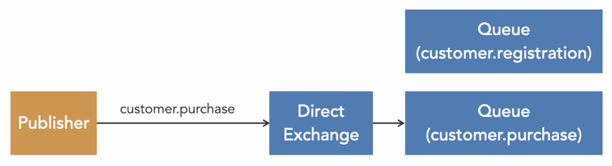
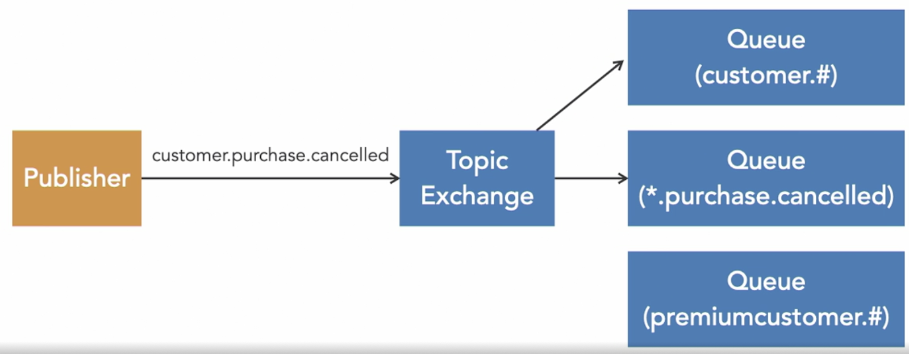
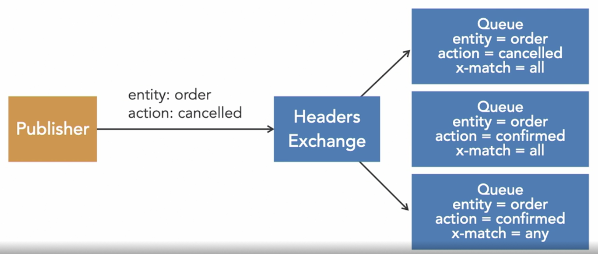

- **Direct Exchange:** Routes messages to all queues that have been connected to this exchange with the same routing key as the routing key that the publisher used.

- **Fanout Exchange:** Routes messages to all bound queues and the routing key is ignored.

- **Topic Exchange:** Routes messages based on patterns in the routing key. If a binding is declared with a `#`, this symbol matches zero or more words in the routing key. You can also use `*`, which will match a single word.

- **Headers Exchange:** Ignores the routing key and instead look at the headers sent with the message. When binding a queue to this exchange, we must decide if we want to match all or any of these headers. Headers don’t have to be strings, they can also be integers or dictionaries.

##### Use Cases
- **Simple scenarios:** Direct
    - When you have a simple scenario that won’t involve too many exchanges, bindings, and queues.
- **Broadcasting:** Fanout
    - When your message is going to be sent to all consumers.
- **Complex scenarios:** Topic
    - When you expect your system to scale in the future or need categorization or filtering. Topic exchanges provide the most flexibility if required.
- **Special filtering:** Headers
    - Only recommended if you really need the special filtering mechanism that it provides.

<small> Source: [LinkedIn Learning: Learning RabbitMQ - The exchange types](https://www.linkedin.com/learning/learning-rabbitmq/the-exchange-types?resume=false&u=57075649)</small>
<small> Source: [LinkedIn Learning: Learning RabbitMQ - Exchange type use cases](https://www.linkedin.com/learning/learning-rabbitmq/exchange-type-use-cases?resume=false&u=57075649)</small>