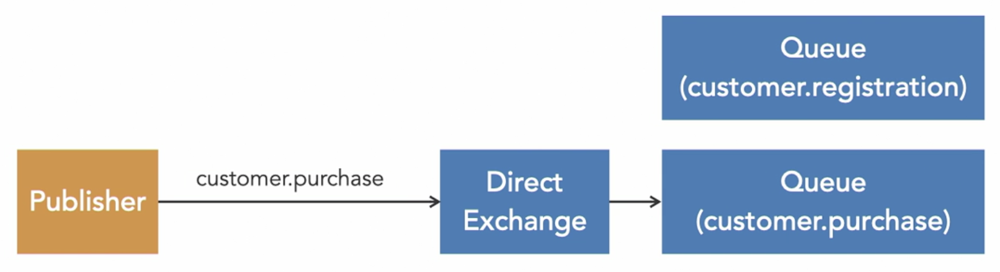
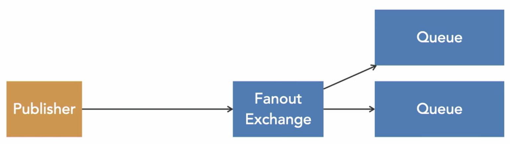
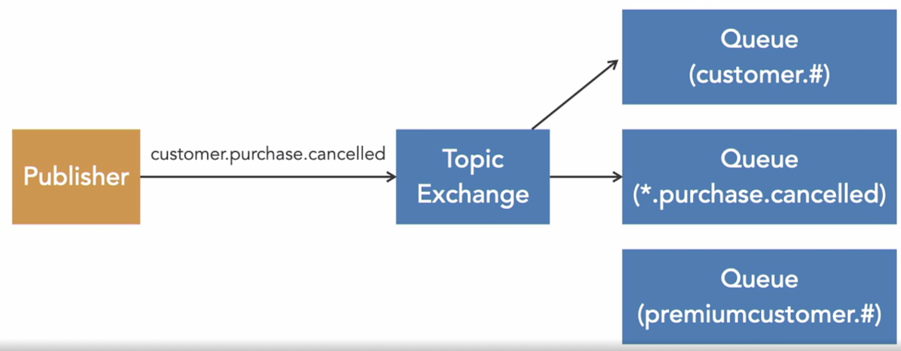
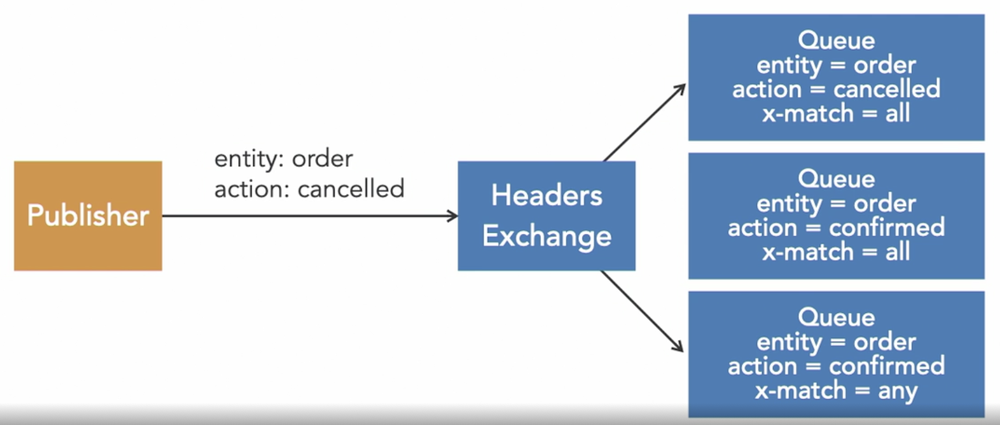

- **Direct Exchange:** Instrada i messaggi a tutte le code collegate a questo exchange con la stessa routing key utilizzata dal publisher.  

- **Fanout Exchange:** Instrada i messaggi a tutte le code collegate e la routing key viene ignorata.  

- **Topic Exchange:** Instrada i messaggi in base ai pattern nella routing key. Se un binding è dichiarato con `#`, questo simbolo corrisponde a zero o più parole nella routing key. È possibile usare anche `*`, che corrisponde a una singola parola.  

- **Headers Exchange:** Ignora la routing key e guarda invece agli header inviati con il messaggio. Quando si collega una coda a questo exchange, dobbiamo decidere se vogliamo che corrispondano tutti o solo alcuni di questi header. Gli header non devono essere necessariamente stringhe: possono anche essere interi o dizionari.  

##### Casi d’uso
- **Scenari semplici:** Direct  
    - Quando hai uno scenario semplice che non coinvolge troppi exchange, binding e code.  
- **Broadcasting:** Fanout  
    - Quando il tuo messaggio deve essere inviato a tutti i consumer.  
- **Scenari complessi:** Topic  
    - Quando prevedi che il tuo sistema debba scalare in futuro o hai bisogno di categorizzazione o filtraggio. I topic exchange forniscono la massima flessibilità se necessaria.  
- **Filtraggio speciale:** Headers  
    - Raccomandato solo se hai davvero bisogno del particolare meccanismo di filtraggio che fornisce.  

<small>Fonte: [LinkedIn Learning: Learning RabbitMQ - The exchange types](https://www.linkedin.com/learning/learning-rabbitmq/the-exchange-types?resume=false&u=57075649)</small>  
<small>Fonte: [LinkedIn Learning: Learning RabbitMQ - Exchange type use cases](https://www.linkedin.com/learning/learning-rabbitmq/exchange-type-use-cases?resume=false&u=57075649)</small>