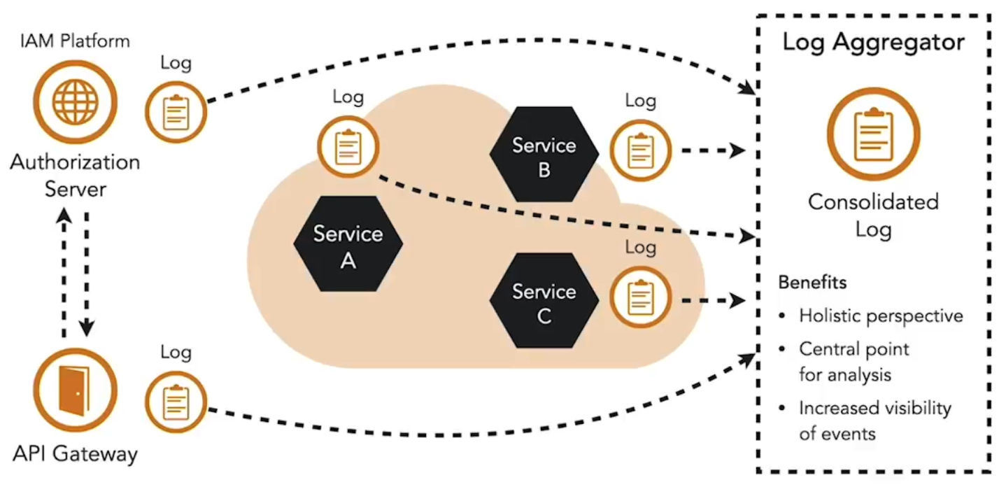

Logging er et af de vigtigste værktøjer til observability i et distribueret system. Det understøtter detektion af mistænkelig adfærd, undersøgelse af hændelser, revision af følsomme operationer og fejlfinding. For at være effektiv skal logs følge en konsistent struktur, som er aftalt på tværs af alle microservice-teams. Standardframeworks og fælles konfigurationer hjælper med at håndhæve ensartede mønstre. Logs bør inkludere både succesfulde og fejlede aktiviteter, såsom autorisationsfejl eller ugyldige endpoints, da disse kan indikere scanning eller angrebsforsøg.

Fordi microservices er distribuerede, skal logs fra alle instanser aggregeres på en central host. Dette giver et komplet billede af systemaktivitet og muliggør automatiseret overvågning, der kan opdage anomalier som fejlede mTLS-handshakes, ugyldige tokens eller usædvanlige trafikmønstre. Alarmer kan derefter sendes videre til incident response-systemer.

For at fange det fulde flow af en forespørgsel på tværs af services skal logs også korreleres. Dette opnås gennem tracing. Hver forespørgsel tildeles en unik trace-identifikator, som inkluderes i alle log- og tidsudskrifter for den pågældende forespørgsel. Hver service, der modtager forespørgslen, fortsætter med at bruge den samme identifikator og sender den videre nedstrøms. Dette gør det muligt at rekonstruere hele forløbet af en forespørgsel gennem systemet og analysere både adfærd og performance på en konsistent måde.

<small> Kilde: [LinkedIn Learning: Microservices Foundations](https://www.linkedin.com/learning/microservices-foundations-23469069?contextUrn=urn%3Ali%3AlyndaLearningPath%3A645bcd56498e6459e79b3c71&u=57075649)</small>  
<small> Kilde: [LinkedIn Learning: Securing Microservices](https://www.linkedin.com/learning/microservices-security/securing-microservices?contextUrn=urn%3Ali%3AlyndaLearningPath%3A645bcd56498e6459e79b3c71&resume=false&u=57075649)</small>