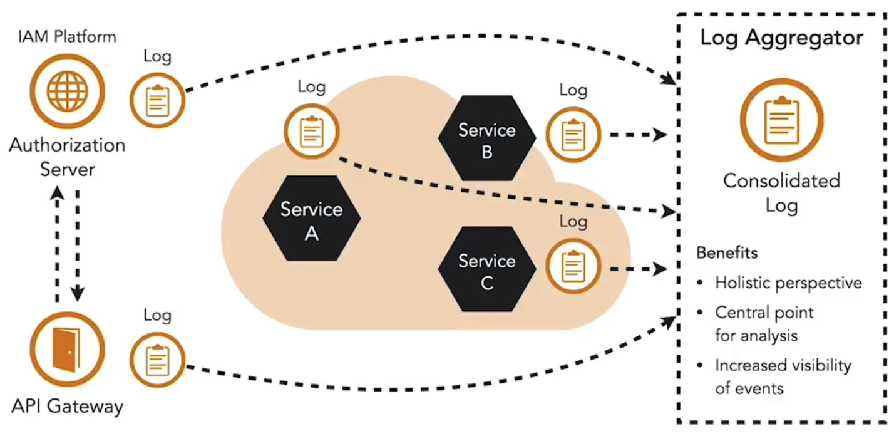

Logging is one of the most important tools for observability in a distributed system. It supports detecting suspicious behavior, investigating incidents, auditing sensitive operations, and troubleshooting failures. To be effective, logs must follow a consistent structure agreed upon across all microservice teams. Standard frameworks and shared configurations help enforce uniform patterns. Logs should include both successful and failed activities, such as authorization errors or invalid endpoints, since these may indicate scanning or attack attempts.

Because microservices are distributed, logs from all instances need to be aggregated at a central host. This creates a complete picture of system activity and allows automated monitoring to detect anomalies such as failed mTLS handshakes, invalid tokens, or unusual traffic patterns. Alerts can then be raised through incident response systems.

To capture the complete flow of a request across services, logs must also be correlated. This is achieved through tracing. Each request is assigned a unique trace identifier, which is included in all log and timing output for that request. Every service that receives the request continues to use the same identifier and passes it downstream. This makes it possible to reconstruct the full path of a request through the system and analyze both behavior and performance in a consistent way.

<small> Source: [LinkedIn Learning: Microservices Foundations](https://www.linkedin.com/learning/microservices-foundations-23469069?contextUrn=urn%3Ali%3AlyndaLearningPath%3A645bcd56498e6459e79b3c71&u=57075649)</small>  
<small> Source: [LinkedIn Learning: Securing Microservices](https://www.linkedin.com/learning/microservices-security/securing-microservices?contextUrn=urn%3Ali%3AlyndaLearningPath%3A645bcd56498e6459e79b3c71&resume=false&u=57075649)</small>