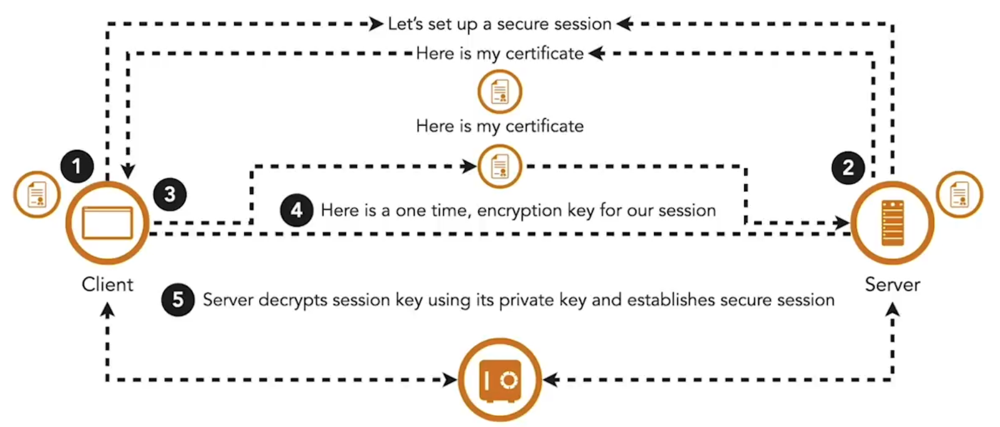

I en zero-trust-model verificerer hver microservice identiteten på enhver kaldende part og integriteten af de data, den modtager. Digitale certifikater er standardmåden at etablere identitet på og indeholder enhedsdetaljer, en offentlig nøgle og information om den udstedende certifikatmyndighed.

TLS sikrer kommunikation ved at kryptere trafikken mellem klient og server, men autentificerer typisk kun serveren. Klienten validerer serverens certifikat mod betroede myndigheder, mens serveren ikke verificerer klienten.

**Mutual TLS (mTLS)** udvider dette ved at kræve, at begge sider præsenterer gyldige certifikater fra en betroet myndighed, før kanalen etableres. Det sikrer, at microservices kan identificere og have tillid til hinanden, før data udveksles. mTLS bruges bredt til at sikre service-til-service kommunikation og bør også beskytte kommunikationen mellem API-gatewayen og services. Uden et betroet certifikat kan selv en angriber inde i netværket ikke kalde en service.

At administrere mTLS i stor skala giver udfordringer. Microservices kører ofte i flygtige containere, så udstedelse og rotation af certifikater skal automatiseres. Container-orkestratorer og service meshes indeholder typisk indbyggede funktioner til at håndtere disse opgaver.

<small> Kilde: [LinkedIn Learning: Securing Microservices](https://www.linkedin.com/learning/microservices-security/securing-microservices?contextUrn=urn%3Ali%3AlyndaLearningPath%3A645bcd56498e6459e79b3c71&resume=false&u=57075649)</small>