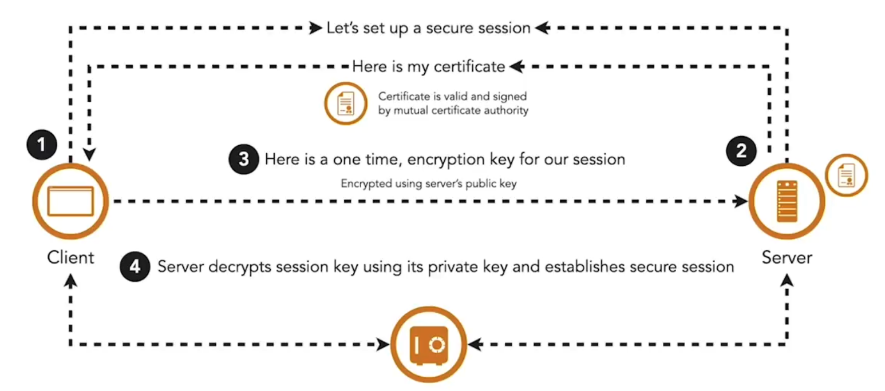
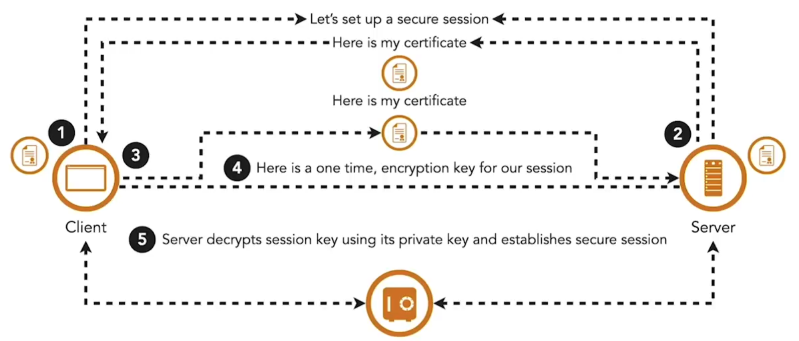

In a zero-trust model, each microservice verifies the identity of any caller and the integrity of the data it receives. Digital certificates are the standard way to establish identity, containing entity details, a public key, and information about the issuing certificate authority.

TLS secures communication by encrypting traffic between client and server, but typically only authenticates the server. The client validates the server’s certificate against trusted authorities, while the server does not verify the client.

**Mutual TLS (mTLS)** extends this by requiring both sides to present valid certificates from a trusted authority before establishing the channel. This ensures microservices can identify and trust each other before exchanging data. mTLS is widely used to secure service-to-service communication and should also protect communication between the API gateway and microservices. Without a trusted certificate, even an attacker inside the network cannot call a service.

Managing mTLS at scale introduces challenges. Microservices often run in ephemeral containers, so certificate provisioning and rotation must be automated. Container orchestrators and service meshes typically include built-in features to manage these tasks.

<small> Source: [LinkedIn Learning: Securing Microservices](https://www.linkedin.com/learning/microservices-security/securing-microservices?contextUrn=urn%3Ali%3AlyndaLearningPath%3A645bcd56498e6459e79b3c71&resume=false&u=57075649)</small>