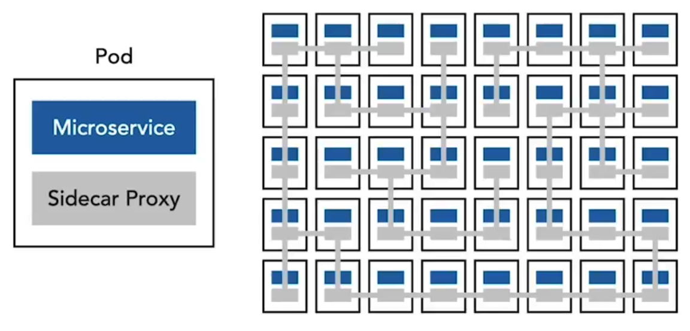
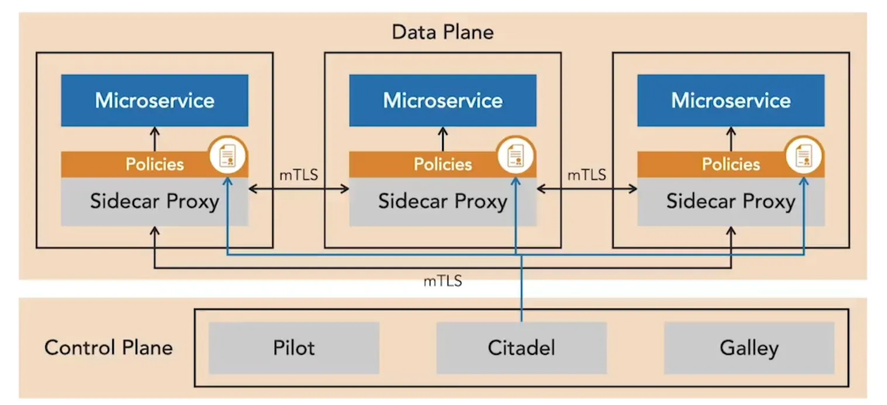

En service mesh sikrer kommunikation mellem microservices, der kører i containere under et container-orkestreringssystem. Den bruger sidecar-proxies, som placeres ved siden af hver service-container og opfanger både indgående og udgående trafik. Disse proxies giver et punkt til at håndhæve sikkerhedstiltag såsom mutual TLS, adgangspolitikker og audit-logging.

Når flere instanser af en microservice udrulles, får hver sin egen proxy, hvilket danner et sammenkoblet mesh.

Opsætningen er transparent for microservices, da proxyen kører i samme pod som service-containeren.

**Istio** er en af de mest anvendte service meshes. Dens arkitektur er opdelt i et **data plane** og et **control plane**. Data plane består af sidecar-proxies, der håndterer service-til-service-kommunikation, mens control plane styrer politikker og konfiguration for disse proxies. En komponent kaldet **Pilot** skubber disse politikker ind i mesh’en uden at kræve kodeændringer i selve microservices. Politikker kan være brede, f.eks. at definere hvilke services der må kommunikere, eller meget granulære, f.eks. at kræve bestemte JWT-claims på forespørgsler.

Proxies i mesh’en understøtter også observability. De kan indsamle logs og traces, som videresendes til monitoreringsplatforme. Istio bruger request- og trace-ID’er til at spore forespørgsler, når de bevæger sig gennem services, hvilket gør det muligt at korrelere med microservice-logs. Det giver også detaljerede adgangslogs til audit og visualisering af forespørgselsforløb gennem systemet.

En stor fordel ved Istio er, at det leverer **mutual TLS out of the box**. Control plane indeholder en certifikatmyndighed, **Citadel**, som monterer certifikater og nøglepar i Kubernetes-pods ved opstart og automatiserer certifikatrotation. Med minimal konfiguration får services stærk autentificering og kryptering, hvilket i høj grad forbedrer sikkerheden.

<small> Kilde: [LinkedIn Learning: Securing Microservices](https://www.linkedin.com/learning/microservices-security/securing-microservices?contextUrn=urn%3Ali%3AlyndaLearningPath%3A645bcd56498e6459e79b3c71&resume=false&u=57075649)</small>