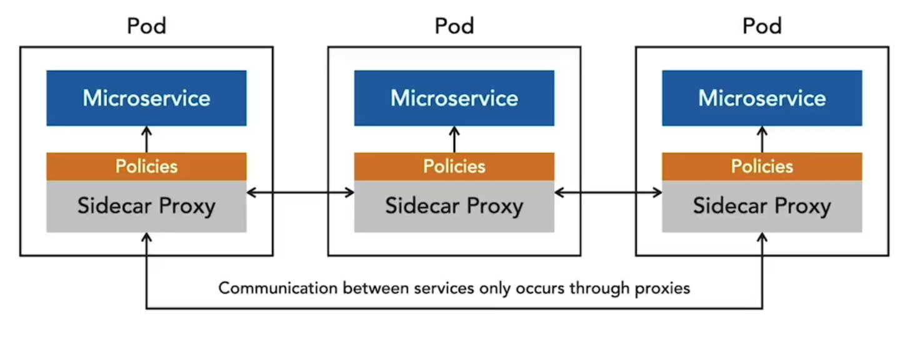
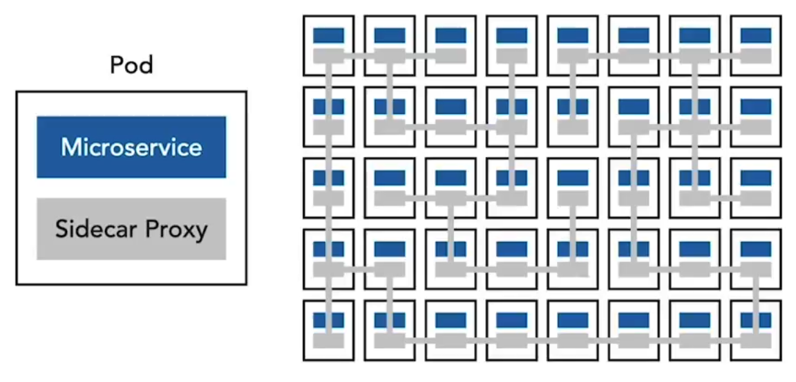
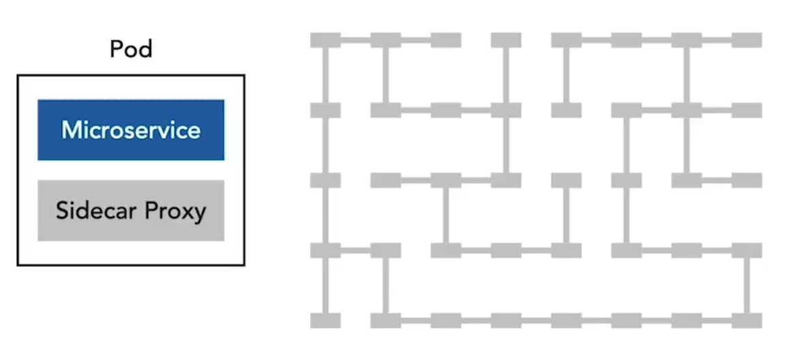
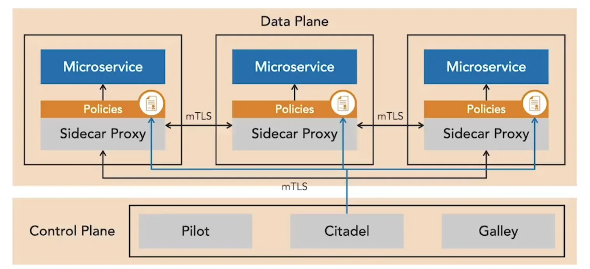

A service mesh secures communication between microservices deployed in containers under a container orchestration system. It uses sidecar proxies that sit next to each service container, intercepting inbound and outbound traffic. These proxies provide a point to enforce security measures such as mutual TLS, access policies, and audit logging.

As more instances of a microservice are deployed, each receives its own proxy, forming an interconnected mesh.

The setup is transparent to the microservices, since the proxy runs in the same pod as the service container.

**Istio** is one of the most widely used service meshes. Its architecture is divided into a data plane and a control plane. The data plane is made up of the sidecar proxies that handle service-to-service communication, while the control plane manages the policies and configuration of those proxies. A component called Pilot pushes these policies into the mesh without requiring code changes in the microservices themselves. Policies can be broad, such as defining which services are allowed to communicate, or very granular, such as requiring specific JWT claims on requests.

The proxies in the mesh also support observability. They can collect logs and traces, which are forwarded to monitoring platforms. Istio uses request and trace IDs to track requests as they move across services, allowing correlation with microservice logs. It also provides detailed access logs for auditing and visualizing request paths through the system.

A major benefit of Istio is that it provides mutual TLS out of the box. Its control plane includes a certificate authority, Citadel, which mounts certificates and key pairs into Kubernetes pods at startup and automates certificate rotation. With minimal configuration, services gain strong authentication and encryption, greatly improving security.

<small> Source: [LinkedIn Learning: Securing Microservices](https://www.linkedin.com/learning/microservices-security/securing-microservices?contextUrn=urn%3Ali%3AlyndaLearningPath%3A645bcd56498e6459e79b3c71&resume=false&u=57075649)</small>