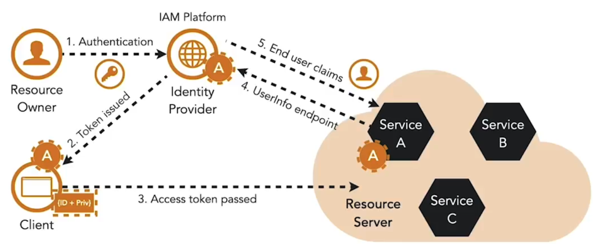

OpenID Connect er et tyndt identitetslag, der ligger oven på OAuth. Standarden beskriver, hvordan funktioner som autentificering og brugerprofilinformation leveres ved hjælp af en autentificeringsanmodning, et ID-token og et user info-endpoint.

OpenID Connect:

- Etablerer et centralt punkt til at identificere (autentificere) slutbrugere  
- Adskiller autentificering fra klientapplikationer  

Identity tokenet, som er i JWT-format, indeholder et standardsæt af claims, der giver information om autentificeringshændelsen, token-udstederen, slutbrugeren og tokenets udløb.

Da ID-tokenet er en JWT, indeholder det en kryptografisk signatur, der beskytter tokenet mod manipulation.

Identity tokens bør kun bruges af klienter og bør ikke anvendes til API-adgang. For at etablere brugeridentitet i en microservice kan access tokenet sendes til identity providerens user info-endpoint for at modtage claims med information om slutbrugeren. Dette gør det muligt for microservice at hente information om slutbrugeren.

<small> Kilde: [LinkedIn Learning: Securing Microservices](https://www.linkedin.com/learning/microservices-security/securing-microservices?contextUrn=urn%3Ali%3AlyndaLearningPath%3A645bcd56498e6459e79b3c71&resume=false&u=57075649)</small>