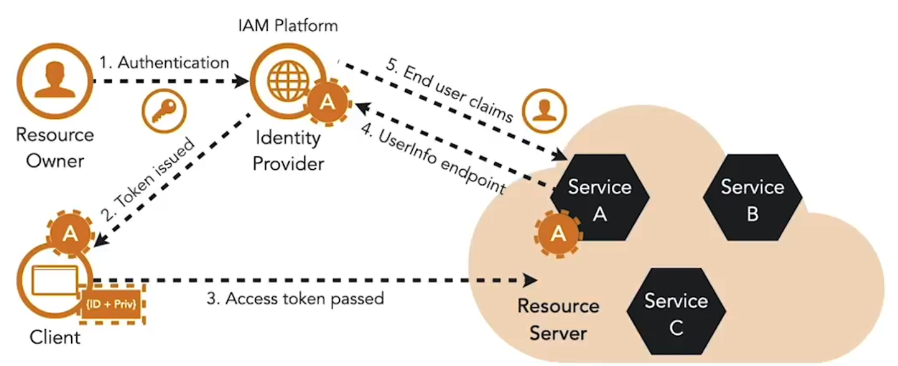

OpenID Connect è un sottile livello di identità che si basa su OAuth. Lo standard descrive come funzionalità come autenticazione e informazioni sul profilo utente vengano fornite tramite una richiesta di autenticazione, un ID token e un endpoint user info.

OpenID Connect:

- Stabilisce un punto centrale per identificare (autenticare) gli utenti finali  
- Disaccoppia l’autenticazione dalle applicazioni client  

L’identity token, che è in formato JWT, contiene un set standard di claims che forniscono informazioni sull’evento di autenticazione, sull’emittente del token, sull’utente finale e sulla scadenza del token.

Poiché l’ID token è un JWT, contiene una firma crittografica che protegge il token da manomissioni.

Gli identity token dovrebbero essere utilizzati solo dai client e non dovrebbero essere usati per l’accesso alle API. Per stabilire l’identità dell’utente in un microservizio, l’access token può essere passato all’endpoint user info dell’identity provider per ricevere claims con informazioni sull’utente finale. Questo permette al microservizio di ottenere informazioni sull’utente finale.

<small> Fonte: [LinkedIn Learning: Securing Microservices](https://www.linkedin.com/learning/microservices-security/securing-microservices?contextUrn=urn%3Ali%3AlyndaLearningPath%3A645bcd56498e6459e79b3c71&resume=false&u=57075649)</small>