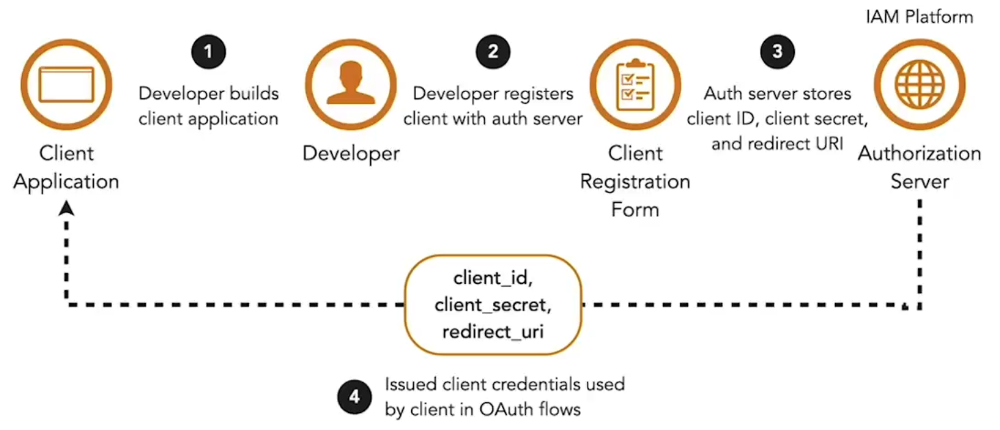

Tokens udstedes til en klient efter en række kald er orkestreret mellem resource owner, klientapplikationen og authorization-serveren.

1. Resource owner autentificerer sig hos authorization-serveren med sine legitimationsoplysninger. Derefter giver resource owner samtykke til, at klienten får adgang til deres beskyttede ressourcer.  

2. Dette får authorization-serveren til at oprette eller “minte” et access token, som udstedes til klienten. Hvis access tokenet er et reference token, skal det lagres på dette tidspunkt.  

**Fordele ved tokens:**

1. Microservices behøver ikke gemme brugerens legitimationsoplysninger, da autentificering håndteres centralt af authorization-serveren.  
2. Klienten håndterer aldrig legitimationsoplysninger, da de håndteres centralt af authorization-serveren. Dette forhindrer, at et password stjæles fra en klient, der lagrer det. Det undgår også mange problemer med informations fortrolighed og integritet.  

**Grant-typer:**

- Authorization code  
- Client credentials  
- Implicit  
- Resource owner  

Authorization code grant og client credentials grant er de mest anvendte i microservices.

Begge grant-typer definerer HTTPS-kald til specifikke endpoints, der forventes på authorization-serveren, og som bruges af klienten i processen med at få et token. Før dette skal klienten og dens redirect URI være registreret hos authorization-serveren. Registreringen udføres af udvikleren af klientapplikationen via en formular i udviklerportalen. Når formularen er udfyldt, udstedes et client ID og client secret til applikationen. Klientens legitimationsoplysninger i en redirect URI bruges af authorization-serveren til at autentificere klienten og beskytte mod redirection-angreb.  

Når disse forudsætninger er opfyldt, kan klienter gennemføre sekvensen af HTTPS-kald til authorization-flows, f.eks. authorization code grant.  

<small> Kilde: [LinkedIn Learning: Securing Microservices](https://www.linkedin.com/learning/microservices-security/securing-microservices?contextUrn=urn%3Ali%3AlyndaLearningPath%3A645bcd56498e6459e79b3c71&resume=false&u=57075649)</small>