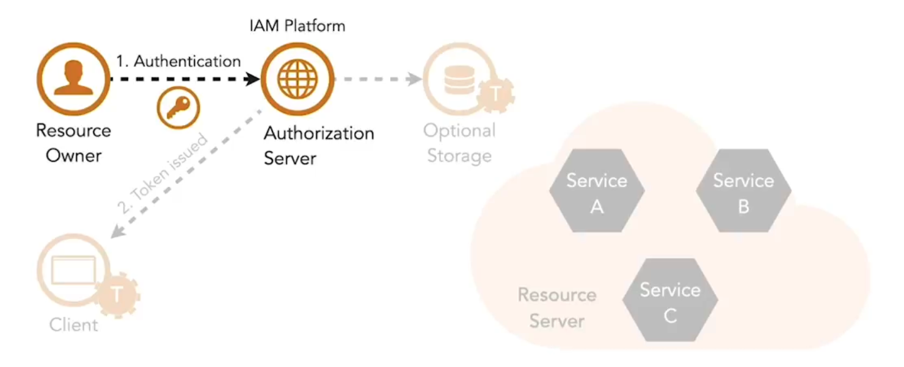
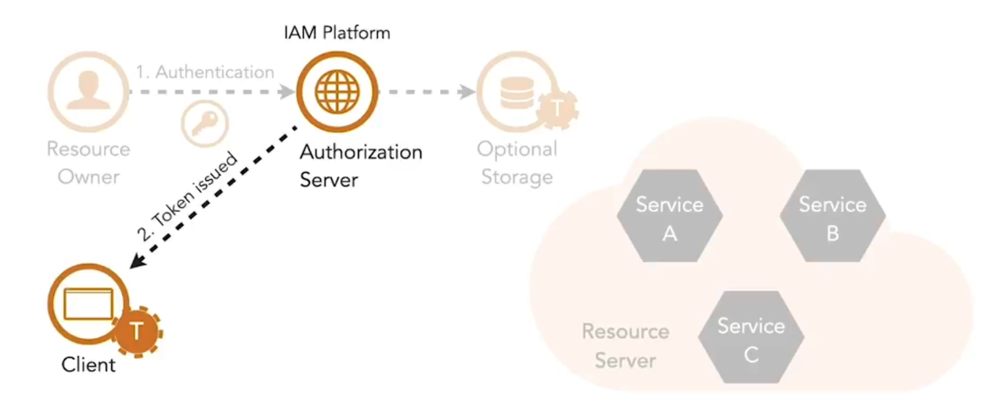
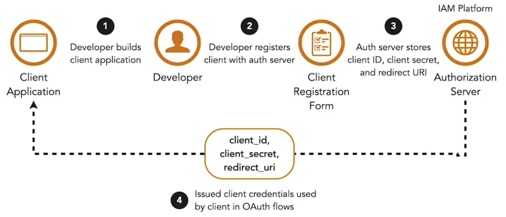

Tokens are issued to a client after a series of calls are orchestrated between the resource owner, the client application and the authorization server.

1. The resource owner authenticates with the authorization server using their credentials. Then the resource owner consents to the client accessing their protected resources.  

2. This causes the authorization server to create or mint an access token that is provided to the client. If the access token is a reference token, it must be stored at this point in time.  

**Token benefits:**

1. The microservice is not required to store user credentials because authentication is handled centrally by the authorization server.  
2. The client never handles the credentials because they are handled centrally by the authorization server. This prevents a password from being stolen from a client that stores it. It also avoids many issues with information confidentiality and integrity.  

**Grant types:**

- Authorization code  
- Client credentials  
- Implicit  
- Resource owner  

Authorization code grant and client credentials grant are most commonly used in microservices.

Both grant types define HTTPS calls to specific endpoints expected on the authorization server that are used by the client in the process of obtaining a token. Before this, the client and its redirect URI are expected to be registered with the authorization server. Registration is completed by the developer of the client application, using a registration form in the developer portal. Once the form is completed, a client ID and client secret will be issued to the application. The client’s credentials in a redirect URI are used by the authorization server to authenticate the client and protect against redirection attacks.  

Once these prerequisites are satisfied, clients can complete the sequence of HTTPS calls for authorization flows, like the authorization code grant.  

<small> Source: [LinkedIn Learning: Securing Microservices](https://www.linkedin.com/learning/microservices-security/securing-microservices?contextUrn=urn%3Ali%3AlyndaLearningPath%3A645bcd56498e6459e79b3c71&resume=false&u=57075649)</small>