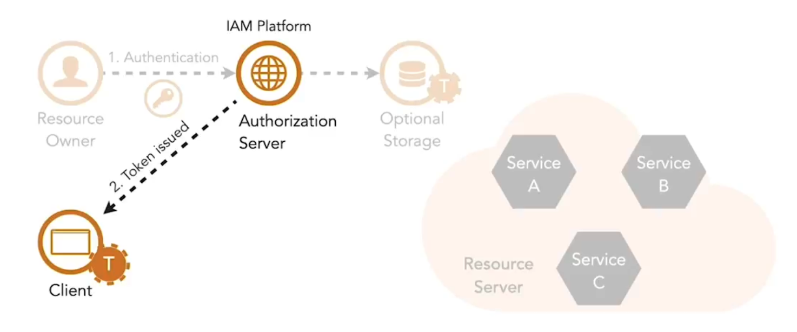

I token vengono emessi a un client dopo che una serie di chiamate è stata orchestrata tra il resource owner, l’applicazione client e l’authorization server.

1. Il resource owner si autentica con l’authorization server usando le proprie credenziali. Successivamente, il resource owner concede al client l’accesso alle proprie risorse protette.  

2. Questo porta l’authorization server a creare o “mintare” un access token che viene fornito al client. Se l’access token è un reference token, deve essere memorizzato a questo punto.  

**Vantaggi dei token:**

1. Il microservizio non è tenuto a memorizzare le credenziali dell’utente perché l’autenticazione è gestita centralmente dall’authorization server.  
2. Il client non gestisce mai le credenziali perché sono gestite centralmente dall’authorization server. Questo impedisce che una password venga rubata da un client che la memorizza. Evita anche molti problemi di riservatezza e integrità delle informazioni.  

**Tipi di grant:**

- Authorization code  
- Client credentials  
- Implicit  
- Resource owner  

Authorization code grant e client credentials grant sono i più comunemente usati nei microservizi.

Entrambi i tipi di grant definiscono chiamate HTTPS a specifici endpoint previsti sull’authorization server, utilizzate dal client nel processo di ottenimento di un token. Prima di ciò, il client e il suo redirect URI devono essere registrati presso l’authorization server. La registrazione viene completata dallo sviluppatore dell’applicazione client tramite un modulo nel portale sviluppatori. Una volta completato il modulo, all’applicazione verranno rilasciati un client ID e un client secret. Le credenziali del client in un redirect URI vengono utilizzate dall’authorization server per autenticare il client e proteggere da attacchi di redirection.  

Una volta soddisfatti questi prerequisiti, i client possono completare la sequenza di chiamate HTTPS per i flussi di autorizzazione, come l’authorization code grant.  

<small> Fonte: [LinkedIn Learning: Securing Microservices](https://www.linkedin.com/learning/microservices-security/securing-microservices?contextUrn=urn%3Ali%3AlyndaLearningPath%3A645bcd56498e6459e79b3c71&resume=false&u=57075649)</small>