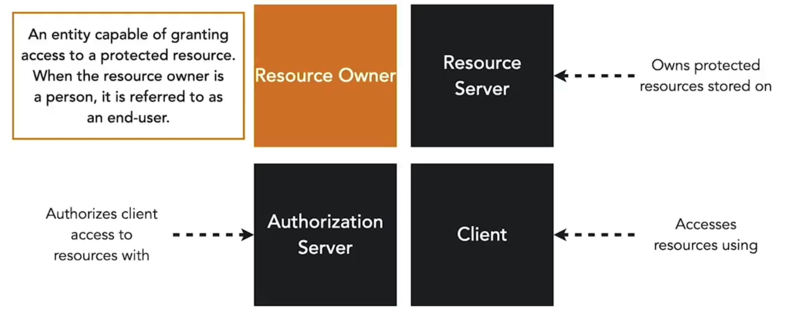
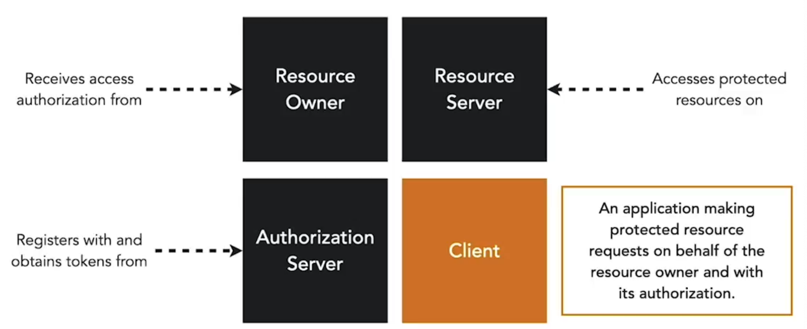

**Roller:**

- **Resource owner:** Slutbrugeren, der ejer informationen i en microservice og kan tilgå den.  

- **Resource Server:** Serveren, der hoster API’et foran microservices. Resource serveren gør en resource owners information tilgængelig, hvis et access token leveres.  

- **Authorization:** Authorizationsserveren er ansvarlig for at udstede access tokens til en klient og verificere integriteten af tokens, der sendes til resource serveren.  

- **Client:** En applikation, der tilgår ressourcer på vegne af en resource owner. Den får et token udstedt af authorizationsserveren.  

Disse roller er en del af OAuth2-standarden, der beskriver mekanismen for klienter til at opnå og bruge et access token for at få sikker adgang til beskyttede ressourcer som microservices.

**Grant Types**

- Sekvensen af trin, der udføres for at udstede et access token til en klient  
- Specifikationen beskriver HTTP-kald og parametre, der udveksles mellem klient, resource owner og auth server  

**Scopes**

- Definerer de handlinger, en klient må udføre på et API  
- Klienter anmoder om scopes ved at bruge en parameter i access-anmodningen  

**Authorization Endpoint**

- Authorization endpoint bruges til at interagere med resource owner og opnå en authorization grant. Authorization serveren skal først verificere identiteten af resource owner. Hvordan authorization serveren autentificerer resource owner (f.eks. brugernavn og password-login, session cookies) er uden for OAuth 2.0’s scope.  

<small> Kilde: [LinkedIn Learning: Securing Microservices](https://www.linkedin.com/learning/microservices-security/securing-microservices?contextUrn=urn%3Ali%3AlyndaLearningPath%3A645bcd56498e6459e79b3c71&resume=false&u=57075649)</small>