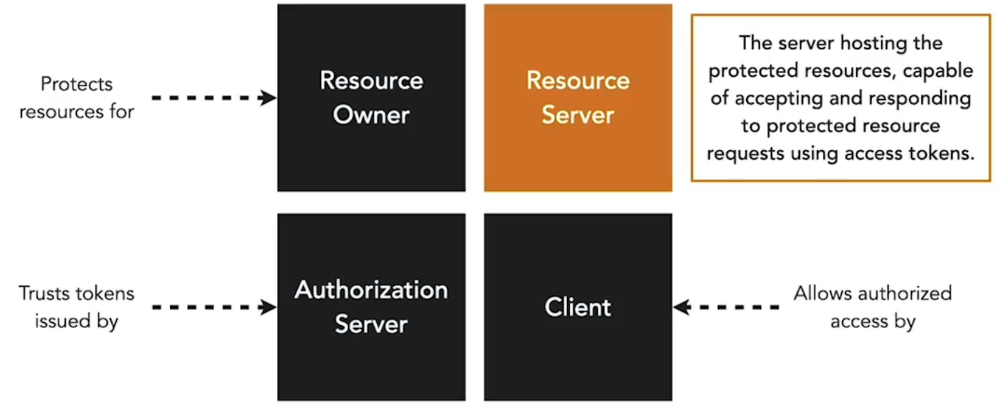
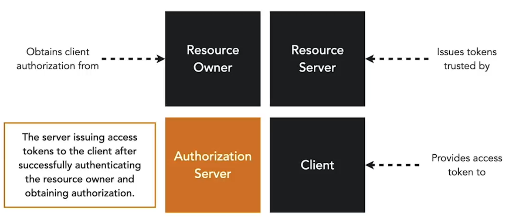

**Roles:**

- **Resource owner:** The end-user who owns the information found in a microservice and can access it.  

- **Resource Server:** The server hosting the API in front of the microservices. The resource server makes a resource owner's information accessible if an access token is provided.  

- **Authorization:** The authorization server is responsible for issuing that access token to a client and verifying the integrity of access tokens passed to the resource server.  

- **Client:** An application that accesses resources on behalf of a resource owner. It is granted a token by the authorization server.  

These roles are part of the OAuth2 standard which describes the mechanism for clients to obtain and use an access token to achieve secure access to protected resources like our microservices.

**Grant Types**

- Sequence of steps taken to issue an access token to a client  
- Specification outlines HTTP calls and parameters exchanged amongst the client, resource owner, and auth server.  

**Scopes**

- Define actions a client may perform on an API  
- Clients request scopes using a parameter in the access request  

**Authorization Endpoint**

- The authorization endpoint is used to interact with the resource owner and obtain an authorization grant. The authorization server must first verify the identity of the resource owner. The way in which the authorization server authenticates the resource owner (e.g., username and password login, session cookies) is beyond the scope of OAuth 2.0.  

<small> Source: [LinkedIn Learning: Securing Microservices](https://www.linkedin.com/learning/microservices-security/securing-microservices?contextUrn=urn%3Ali%3AlyndaLearningPath%3A645bcd56498e6459e79b3c71&resume=false&u=57075649)</small>