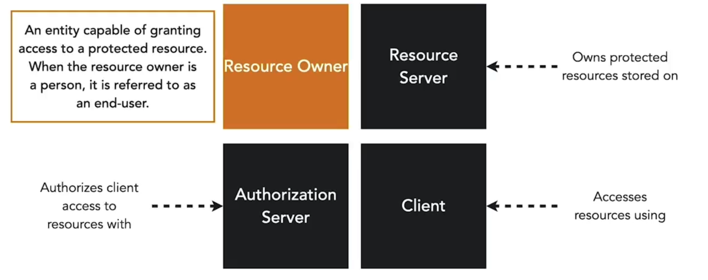
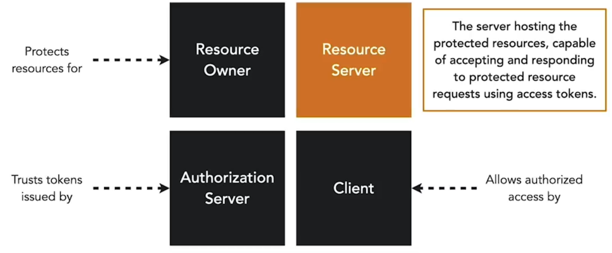
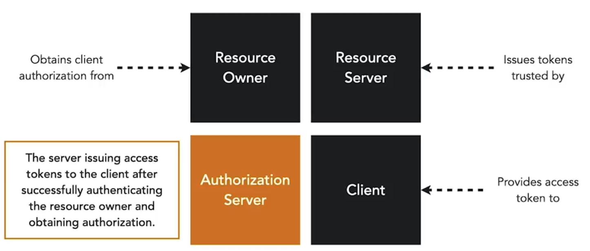
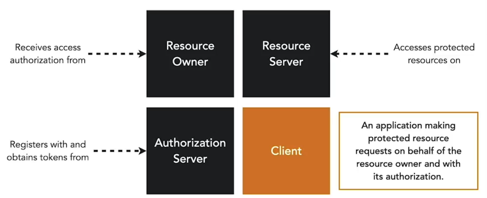

**Ruoli:**

- **Resource owner:** L’utente finale che possiede le informazioni in un microservizio e può accedervi.  

- **Resource Server:** Il server che ospita l’API davanti ai microservizi. Il resource server rende accessibili le informazioni di un resource owner se viene fornito un access token.  

- **Authorization:** L’authorization server è responsabile dell’emissione dell’access token a un client e della verifica dell’integrità dei token passati al resource server.  

- **Client:** Un’applicazione che accede alle risorse per conto di un resource owner. Riceve un token dall’authorization server.  

Questi ruoli fanno parte dello standard OAuth2, che descrive il meccanismo con cui i client ottengono e utilizzano un access token per accedere in modo sicuro a risorse protette come i nostri microservizi.

**Grant Types**

- Sequenza di passi necessari per emettere un access token a un client  
- La specifica descrive le chiamate HTTP e i parametri scambiati tra client, resource owner e auth server  

**Scopes**

- Definiscono le azioni che un client può eseguire su un’API  
- I client richiedono gli scopes usando un parametro nella richiesta di accesso  

**Authorization Endpoint**

- L’authorization endpoint viene utilizzato per interagire con il resource owner e ottenere un authorization grant. L’authorization server deve prima verificare l’identità del resource owner. Il modo in cui l’authorization server autentica il resource owner (ad esempio login con username e password, session cookies) è al di fuori dello scope di OAuth 2.0.  

<small> Fonte: [LinkedIn Learning: Securing Microservices](https://www.linkedin.com/learning/microservices-security/securing-microservices?contextUrn=urn%3Ali%3AlyndaLearningPath%3A645bcd56498e6459e79b3c71&resume=false&u=57075649)</small>