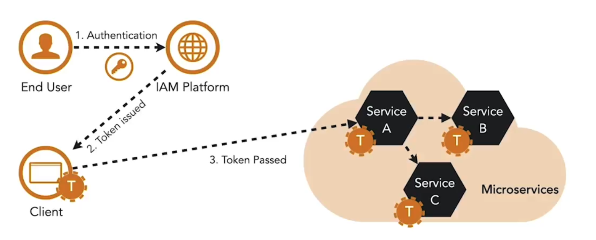

Microservices er afhængige af tokens for at etablere identitet og håndhæve adgangskontrol. I modsætning til monolitter findes der ingen delt session på tværs af services til at gemme brugerstatus, og det er ikke sikkert at videregive legitimationsoplysninger mellem services. Tokens løser dette ved at bære identitets- og adgangsinformation uden at eksponere brugerens legitimationsoplysninger.

Overordnet falder tokens i to formater:

- **Reference tokens**: Opaque strenge uden indlejret betydning. De fungerer som identifikatorer, der peger på metadata gemt i IAM-platformen.  
- **Structured tokens**: Indeholder metadata om autentificeringshændelsen og brugeren. Data lagres som nøgle–værdi-par kaldet *claims*, grupperet i et *claim set*.  

En almindelig standard for structured tokens er **JSON Web Token (JWT)**. JWT’er består af tre dele:

1. **Header**: Angiver, hvordan tokenet er kryptografisk beskyttet.  
2. **Payload**: Indeholder claims om brugeren eller autentificeringshændelsen.  
3. **Signature**: Sikrer integritet ved at bekræfte, at tokenet ikke er ændret siden oprettelsen.  

JWT’er muliggør sikker transmission af bruger- og autentificeringsdata mellem klienter og services og er derfor et udbredt valg i microservices-arkitekturer.

**Typer af tokens**

- **Access token:** Tillader indehaveren af tokenet at tilgå et API  
- **Refresh token:** Bruges til at få et nyt access token, når det oprindelige udløber  
- **ID token:** JWT, der indeholder information om autentificeringshændelsen og brugerens identitet  

**Token-livscyklus**

Livscyklussen for et token begynder, når det udstedes, og slutter, når det enten udløber eller tilbagekaldes. I denne periode bruger microservices tokenet til at etablere brugeridentitet og håndhæve adgangsbeslutninger.

I monolitiske systemer håndterede sessioner denne rolle. I microservices udfylder tokens dette hul, men de er sværere at administrere pga. deres distribuerede natur.

<small> Kilde: [LinkedIn Learning: Securing Microservices](https://www.linkedin.com/learning/microservices-security/securing-microservices?contextUrn=urn%3Ali%3AlyndaLearningPath%3A645bcd56498e6459e79b3c71&resume=false&u=57075649)</small>