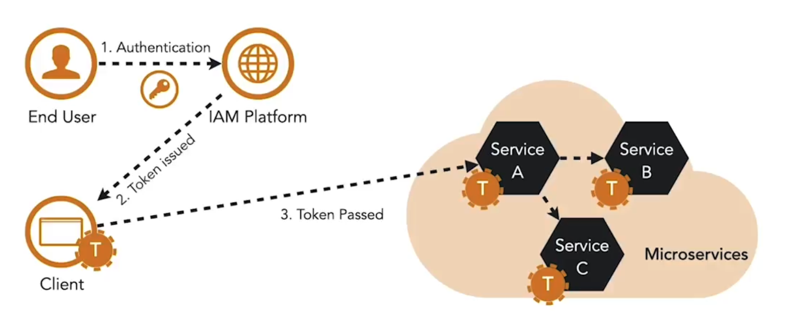
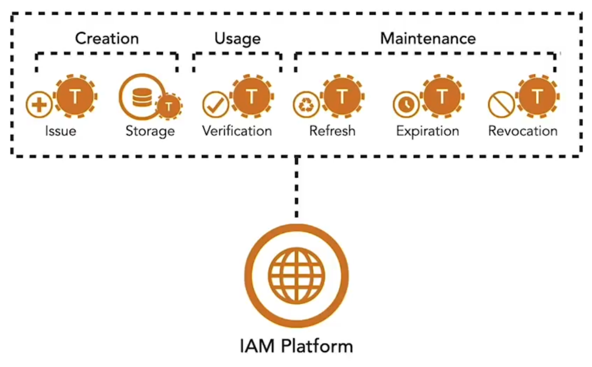

Microservices rely on tokens to establish identity and enforce access control. Unlike monoliths, there is no shared session across services to store user state, and passing credentials between services is not secure. Tokens solve this by carrying identity and access information without exposing user credentials.

At a high level, tokens fall into two formats:

- **Reference tokens**: Opaque strings with no embedded meaning. They act as identifiers that map to stored metadata inside the IAM platform.  
- **Structured tokens**: Contain metadata about the authentication event and user. The data is stored as key–value pairs called claims, grouped into a claim set.  

A common structured token standard is the **JSON Web Token (JWT)**. JWTs are composed of three parts:

1. **Header**: Specifies how the token is cryptographically protected.  
2. **Payload**: Contains claims about the user or authentication event.  
3. **Signature**: Ensures integrity by verifying the token hasn’t changed since creation.  

JWTs allow secure transmission of user and authentication details between clients and services, making them a widely used choice in microservices architectures.

**Types of tokens**

- **Access token:** Allows the bearer of the token to access an API  
- **Refresh token:** Used to obtain a new access token after the original expires  
- **ID token:** JWT containing information about the authentication event and user identity  

**Token lifecycle**

The lifecycle of a token begins when it is issued and ends when it is either expired or revoked. During this time, microservices rely on the token to establish user identity and enforce access decisions.

In monolithic systems, sessions handled this role. In microservices, tokens fill that gap, but they are harder to manage due to their distributed nature.

<small> Source: [LinkedIn Learning: Securing Microservices](https://www.linkedin.com/learning/microservices-security/securing-microservices?contextUrn=urn%3Ali%3AlyndaLearningPath%3A645bcd56498e6459e79b3c71&resume=false&u=57075649)</small>