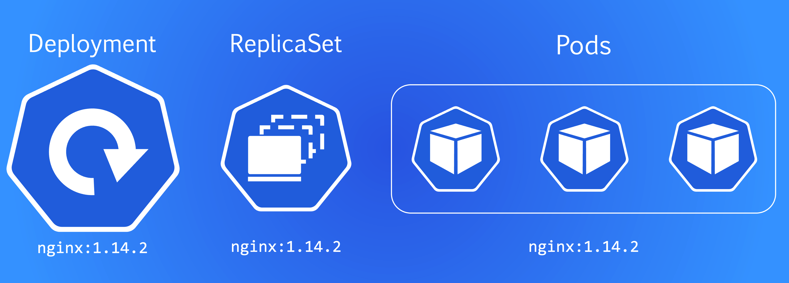
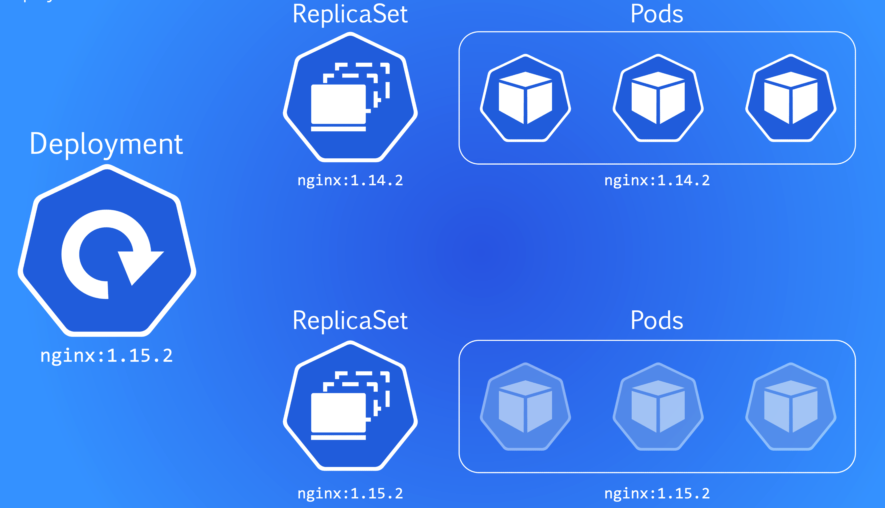
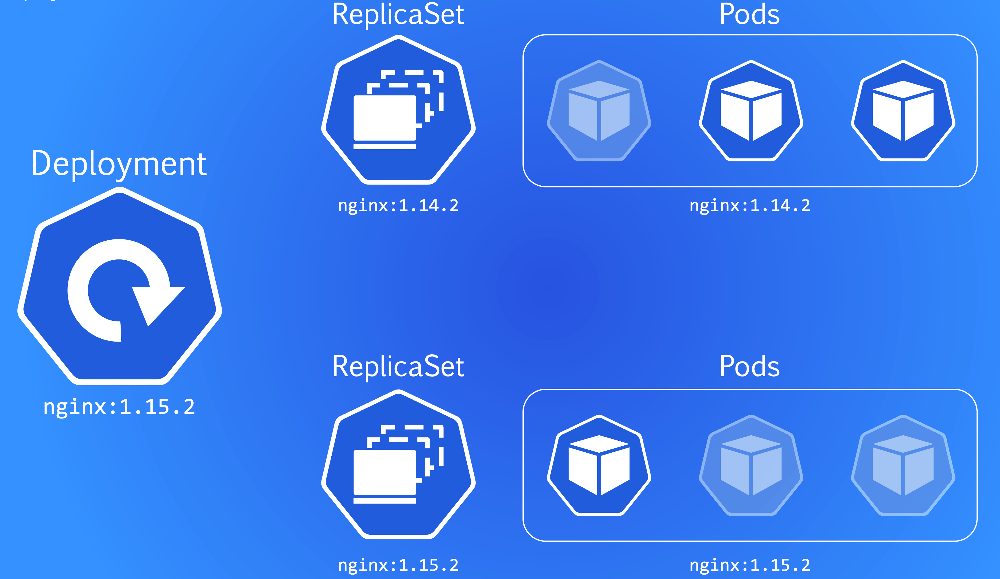
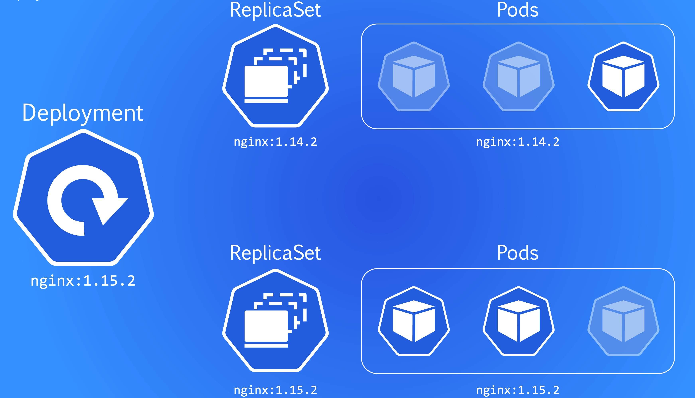
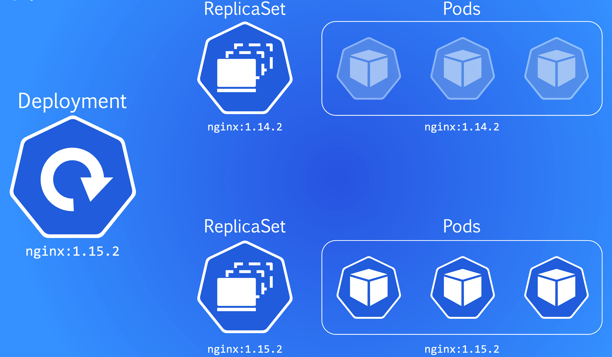

Kubernetes offre due strategie per aggiornare un’applicazione in un Deployment:

##### Recreate  
- Tutti i pod esistenti vengono eliminati contemporaneamente.  
- Dopo la rimozione, Kubernetes crea nuovi pod con la versione aggiornata.  
- L’applicazione subisce downtime durante la transizione.

##### RollingUpdate (default)  
RollingUpdate sostituisce i pod gradualmente per evitare downtime. È controllato da:

- **maxSurge:** Numero massimo di pod aggiuntivi che Kubernetes può creare temporaneamente.  
- **maxUnavailable:** Numero massimo di pod che possono essere disattivati contemporaneamente.  

Entrambi possono essere numeri (es. 1) o percentuali (es. 25%).  
Questa strategia permette aggiornamenti controllati, mantenendo l’applicazione attiva mentre i pod vengono sostituiti uno alla volta.

Se non viene specificata alcuna strategia, Kubernetes usa RollingUpdate con `maxSurge: 1` e `maxUnavailable: 1`.

##### RollingUpdate nella pratica

L’immagine mostra un Deployment in esecuzione normale.

Quando cambia la versione del Deployment, Kubernetes crea automaticamente un nuovo ReplicaSet e inizia a sostituire i pod vecchi con quelli nuovi.

Con `maxSurge` e `maxUnavailable` impostati a 1, Kubernetes scala un pod vecchio giù e uno nuovo su alla volta. I pod rimasti mantengono l’applicazione disponibile.

Durante questa fase, il traffico può essere distribuito tra la versione vecchia e quella nuova. L’app continua a funzionare senza interruzioni.

Quando tutti i pod della nuova versione sono attivi, il ReplicaSet precedente può essere rimosso. Kubernetes lo mantiene solitamente per un rollback rapido.