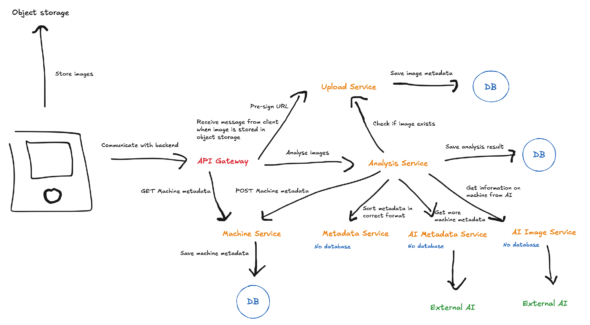

Vi ser vores projekt som bestående af tre hovedprocesser, hver med et specifikt call flow:

##### Billedupload
Client → API Gateway → Upload Service (opret pre-signed URL)  
Client → Object storage (gem billede)  
Client → API Gateway → Upload Service → Gem metadata om billedet i sin egen database

##### Billedanalyse
Client → API Gateway → Analysis Service (orkestrerer workflowet)  
Analysis Service → Upload Service (verificér upload, hent URL)  
Analysis Service → AI Image Service (kør inferens på billed-URL)  
Analysis Service → AI Metadata Service (opslag af yderligere metadata)  
Analysis Service → Metadata Service (match information til attributter)  
Analysis Service → Machine Service (gem maskinmetadata i database)  
Analysis Service → gem analysens resultat i sin egen database  
→ API Gateway → Client

##### Læsning af eksisterende data
Client → API Gateway → Machine Service (ejer maskindatabasen, tilbyder CRUD-operationer)  
→ API Gateway → Client