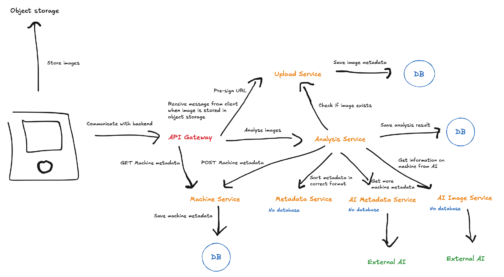

Consideriamo il nostro progetto come composto da tre processi principali, ciascuno con un flusso di chiamate specifico:

##### Caricamento delle immagini
Client → API Gateway → Upload Service (crea URL pre-firmato)  
Client → Object storage (salva immagine)  
Client → API Gateway → Upload Service → salva i metadati dell’immagine nel proprio database

##### Analisi delle immagini
Client → API Gateway → Analysis Service (orchestra il workflow)  
Analysis Service → Upload Service (verifica l’upload, ottieni l’URL)  
Analysis Service → AI Image Service (inferenza sull’URL dell’immagine)  
Analysis Service → AI Metadata Service (ricerca ulteriori metadati)  
Analysis Service → Metadata Service (associa le informazioni agli attributi)  
Analysis Service → Machine Service (salva i metadati della macchina nel database)  
Analysis Service → salva il risultato dell’analisi nel proprio database  
→ API Gateway → Client

#### Lettura dei dati esistenti
Client → API Gateway → Machine Service (possiede il database delle macchine, fornisce operazioni CRUD)  
→ API Gateway → Client