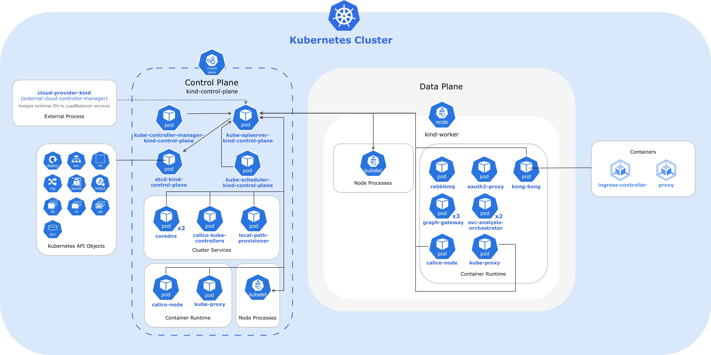
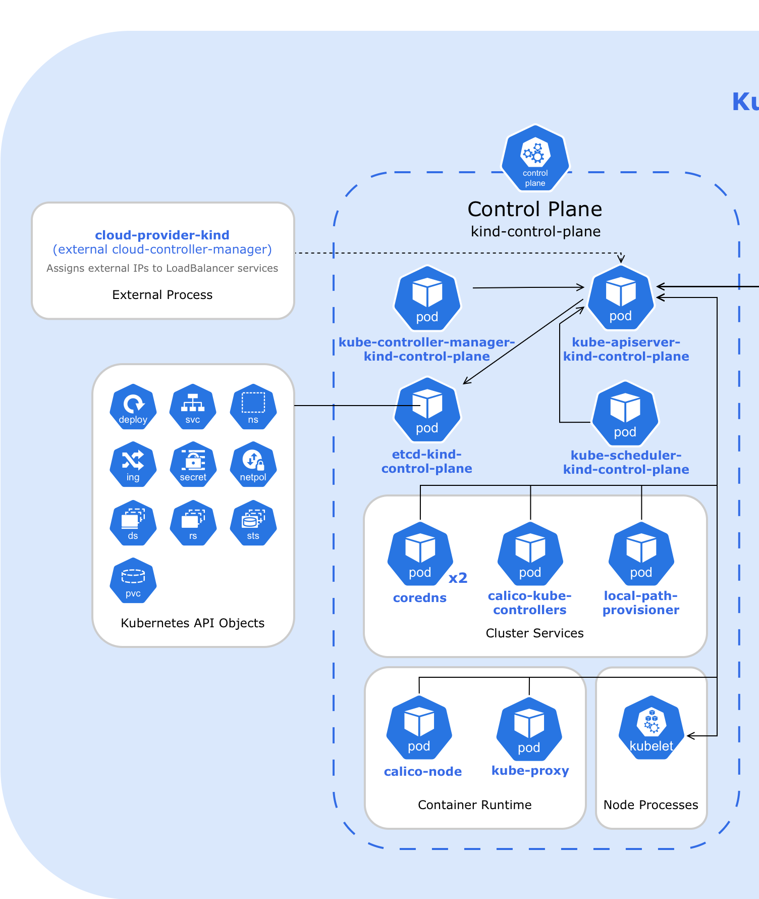
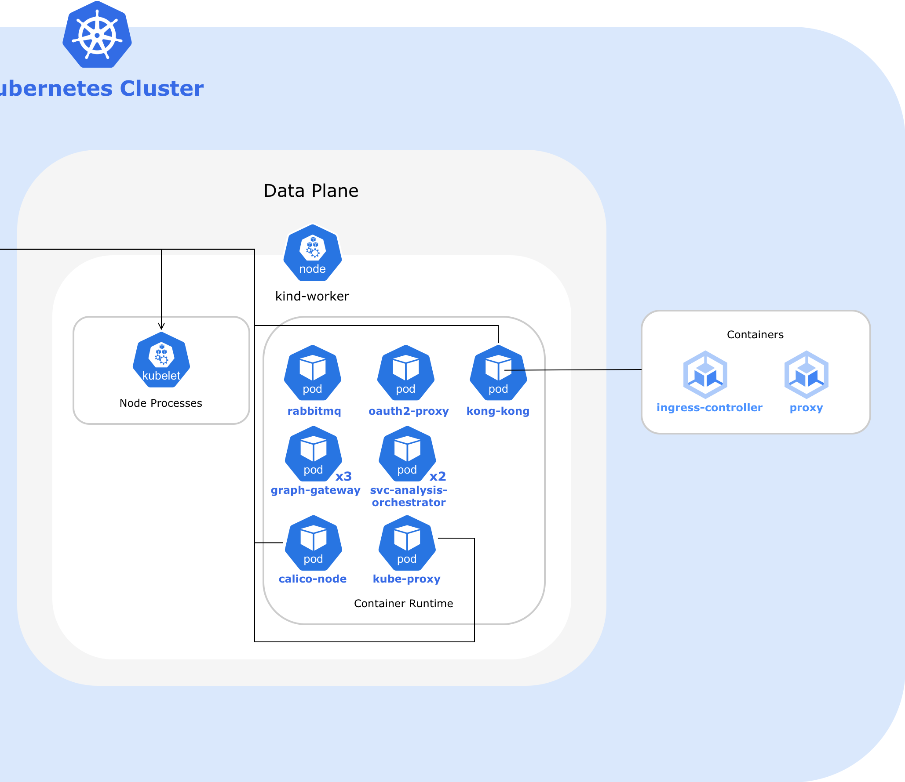

> **Tip:** Open the diagram in a new tab to zoom in and see details.

This diagram provides an overview of the Kubernetes cluster structure in **kind**. It shows the separation between the control plane (**kind-control-plane**) and the data plane (**kind-worker**).

##### kind-control-plane

Runs the control plane components, including **etcd**, **kube-controller-manager**, **kube-apiserver**, **kube-scheduler**, and cluster services such as **coredns**, **calico-kube-controllers**, and **local-path-provisioner**.

It is also considered a node and therefore runs system pods **calico-node** and **kube-proxy**.

**cloud-provider-kind** runs externally as a **cloud-controller-manager** and assigns external IPs to the **kong-kong-proxy** LoadBalancer service.

In **etcd**, the **Kubernetes API Objects** are stored, including **deployments**, **services**, **namespaces**, **ingress**, **secrets**, **network policies**, **daemonSets**, **replicaSets**, **statefulSets**, and **persistentVolumeClaims**.

##### kind-worker

Runs application pods — **graph-gateway**, **svc-analysis-orchestrator**, **oauth2-proxy**, **kong-kong**, and **rabbitmq** — as well as system pods **calico-node** and **kube-proxy** in the container runtime. Runs the node process **kubelet**.

##### Interactions between components and nodes

Most control plane and node components interact with Kubernetes via **kube-apiserver**.  
**kubelet** communicates bidirectionally with **kube-apiserver**, while **etcd** is accessed directly by **kube-apiserver**.